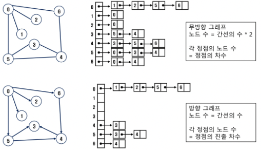

# 그래프

- 아이템(사물 또는 추상적 개념)들과 이들 사이의 연결 관계를 표현한다.
- 정점(vertex)들의 집합과 이들을 연결하는 간선(edge)들의 집합으로 구성된 자료구조이다.
    - |V|: 그래프에 포함된 정점의 개수
    - |E|: 그래프에 포함된 간선의 개수
    - |V|개의 정점을 가지는 그래프의 최대 간선 수: |V| * (|V| - 1) / 2
        - 예. 5개 정점이 있는 그래프의 최대 간선 수는 5*4/2 = 10개이다.
- 선형 자료구조나 트리 자료구조로 표현하기 어려운 N:N 관계를 가지는 원소들을 표현하기에 용이하다.

## 그래프 유형

- 무향 그래프(Undirected Graph)
- 유향 그래프(Directed Graph)
- 가중치 그래프(Weighted Graph)
- 사이클 없는 방향 그래프(DAG, Directed Acyclic Graph)


- 완전 그래프: 정점들에 대해 가능한 모든 간선들을 가진 그래프


- 부분 그래프: 완전 그래프에서 일부의 정점이나 간선을 제외한 그래프

## 용어

- 인접(Adjacency)
    - 두 개의 정점에 간선이 존재(연결됨)하면 서로 인접해 있다고 한다.
    - 완전 그래프에 속한 임의의 두 정점들은 모두 인접해 있다.
- 경로
    - 간선들을 순서대로 나열한 것
    - 단순경로: 경로 중 한 정점을 최대한 한 번만 지나는 경로
    - 사이클(Cycle): 시작한 정점에서 끝나는 경로

## 그래프 표현

- 간선의 정보를 저장하는 방식, 메모리나 성능을 고려해서 결정
- 인접 행렬(Adjacent matrix)
    - |V| x |V| 크기의 2차원 배열을 이용해서 간선 정보를 저장
    - 배열의 배열(포인터 배열)
- 인접 리스트(Adjacent list)
    - 각 정점마다 해당 정점으로 나가는 간선의 정보를 저장
- 간선의 배열
    - 간선(시작 정점, 끝 정점)을 배열에 연속적으로 저장

### 인접 행렬

- 두 정점을 연결하는 간선의 유무를 행렬로 표현
- |V| x |V| 정방 행렬
- 행 변호와 열 번호는 그래프의 정점에 대응
- 두 정점이 인접되어 있으면 1, 그렇지 않으면 0으로 표현
- 무향 그래프
    - i번째 행의 합 = i번째 열의 합 = Vi의 차수
- 유향 그래프
    - i행의 합 = Vi의 진출 차수
    - i열의 합 = Vi의 진입 차수


```python
# V는 노드의 수, E는 간선의 수
V, E = map(int, input().split())
arr = list(map(int, input().split())

# 인접 행렬
adjM = [[0]*(V + 1) for _ in range(V + 1)]

for i in range(E):
    n1, n2 = arr[i*2], arr[i*2 + 1]
    adjM[n1][n2] = 1
    adjM[n2][n1] = 1 # 방향이 없는 경우 반대쪽도 체크

# 인접 리스트
adjList = [[] for _ in range(V + 1)]

for i in range(E):
    n1, n2 = arr[i*2], arr[i*2 + 1]
    adjList[n1].append(n2)
    adjList[n2].append(n1) # 방향이 없는 경우 반대쪽에도 체크
```

### 인접 리스트

- 각 정점에 대한 인접 정점들을 순차적으로 표현
- 하나의 정점에 대한 인접 정점들을 각각 노드로 하는 연결 리스트로 저장
- 무향 그래프
    - 노드 수 = 간선의 수 * 2
    - 각 정점의 노드 수 = 정점의 차수
- 유향 그래프
    - 노드 수 = 간선의 수
    - 각 정점의 노드 수 = 정점의 진출 차수



## 그래프 순회(탐색)

- 비선형구조인 그래프로 표현된 모든 자료(정점)를 빠짐없이 탐색하는 것

### DFS(깊이 우선 탐색)

- 시작 정점의 한 방향으로 갈 수 있는 경로가 있는 곳까지 깊이 탐색해 가다가 더 이상 갈 곳이 없게 되면, 가장 마지막에 만났던 갈림길 간선이 있는 정점으로부터 다른 방향의 정점으로 탐색을 계속 반복하여 모든 정점을 방문하는 순회 방법
- 가장 마지막에 만났던 갈림길의 정점으로 되돌아가서 다시 깊이 우선 탐색을 반복해야 하므로 후입선출 형태의 자료구조인 스택 사용

```python
# swea 5521 dfs로 풀기

def dfs(i, N, c):
    if c == 3:
        return
    else:
        visited[i] = 1
        for j in range(1, N+1):
            if adjM[i][j] and visited[j] == 0:
                dfs(j, N, c+1)

t = int(input())
for tc in range(1, t+1):
    N, M = map(int, input().split())
    adjM = [[0]*(N+1) for _ in range(N+1)]
    for _ in range(M):
        a, b = map(int, input().split())
        adjM[z][b] = 1
        adjM[b][a] = 1
    visited = [0]*(N+1)
    dfs(1, N, 0)
```

### BFS(너비 우선 탐색)

- 시작 정점의 인접한 정점들을 모두 차례로 방문한 후, 방문했던 정점을 시작점으로 하여 다시 인접한 정점들을 차례로 방문하는 탐색을 계속 반복하여 모든 정점을 방문하는 순회 방법
- 인접한 정점들에 대해 탐색을 한 후, 차례로 다시 너비 우선 탐색을 진행해야 하므로, 선입선출 형태의 자료구조인 큐를 사용

```python
# swea 5521 bfs로 풀기
def bfs(N):
    q = [1] # 큐 생성 + 시작점 인큐
	  visited = [0] * (N + 1) # visited 생성
    visited[1] = 1 # 시작점 방문표시

# 이런 식으로 해도 됨
#     cnt = 0
#     while q:
#         t = q.pop(0)
#         cnt += 1
#         if visited[t] <= 2:
#             for i in range(1, N+1):
#                 if adj[t][i] == 1 and visited[i] == 0:
#                     q.append(i)
#                     visited[i] = visited[t] + 1

    while q:
        t = q.pop(0)
	      if visited[t] > 3:
            break
        for i in range(1, N+1):
            if adj[t][i[ and visited[i] == 0:
                q.append(i)
                visited[i] = visited[t] + 1
		cnt = 0
    for i in range(1, N+1):
        if 1 < visited[i] < 4:
            cntn += 1
    return cnt

t = int(input())
for tc in range(1, t+1):
    N, M = map(int, input().split())
    adjM = [[0]*(N+1) for _ in range(N+1)]
    for _ in range(M):
        a, b = map(int, input().split())
        adjM[z][b] = 1
        adjM[b][a] = 1
    ans = bfs(N)
```

## 서로소 집합(Disjoint-sets)

- 서로소 또는 상호배타 집합들은 서로 중복 포함된 원소가 없는 집합들이다. 다시 말해 교집합이 없다.
- 집합에 속한 하나의 특정 멤버를 통해 각 집합들을 구분한다. 이를 대표자(representative)라 한다.
- 상호배타 집합을 표현하는 방법
    - 연결 리스트
    - 트리
- 상호배타 집합 연산
    - Make-Set(x)
        - 유일한 멤버 x를 포함하는 새로운 집합을 생성
    - Find-Set(x)
        - x가 속해있는 집합의 대표 원소를 출력
    - Union(x, y)
        - x가 속해있는 집합과 y가 속해있는 집합을 합쳐서 x를 대표원소로 지정
- 연산의 효율을 높이는 방법
    - Rank를 이용한 Union
        - 각 노드는 자신을 루트로 하는 subtree의 높이를 랭크(Rank)라는 이름으로 저장한다.
        - 두 집합을 합칠 때 rank가 낮은 집합을 rank가 높은 집합에 붙인다.
        - Union 후에도 트리의 최대 높이가 변하지 않음
    - Path compression
        - Find-set을 행하는 과정에서 만나는 모든 노드들이 직접 root를 가리키도록 포인터를 바꾸어 준다.
        - 최초 1회의 코스트가 많이 들지만 이후 서치를 많이할 경우에는 효율 많이 증가함

### 상호배타 집합 표현 - 연결리스트

- 같은 집합의 원소들은 하나의 연결리스트로 관리한다.
- 연결리스트의 맨 앞의 원소를 집합의 대표 원소로 삼는다.
- 각 원소는 집합의 대표 원소를 가리키는 링크를 갖는다.


### 상호배타 집합 표현 - 트리

- 하나의 집합을 하나의 트리로 표현한다.
- 자식 노드가 부모 노드를 가리키며 루트 노드가 대표자가 된다.


## 최소 신장 트리(MST)

- 그래프에서 최소 비용 문제
    - 모든 정점을 연결하는 간선들의 가중치의 합이 최소가 되는 트리(최소 신장 트리)
    - 두 정점 사이의 최소 비용의 경로 찾기(다익스트라)
- 신장 트리
    - n개의 정점으로 이루어진 무방향 그래프에서 n개의 정점과 n-1개의 간선으로 이루어진 트리
- 최소 신장 트리(Minimum Spanning Tree)
    - 무방향 가중치 그래프에서 신장 트리를 구성하는 간선들의 가중치의 합이 최소인 신장 트리


```python
# V는 노드의 수, E는 간선의 수,
# u는 연결 노드 정보1, v는 연결 노드 정보2, w는 가중치

V, E = map(int, input().split())

# 인접 행렬
adjM = [[0]*(V + 1) for _ in range(V + 1)]

for _ in range(E):
    u, v, w = map(int, input().split())
    adjM[u][v] = w
    adjM[v][u] = w

# 인접 리스트
adjList = [[] for _ in range(V + 1)]

for _ in range(E):
    u, v, w = map(int, input().split())
    adjL[u].append((v, w))
    adjL[v].append((u, w))
```

### Prim 알고리즘

- 하나의 정점에서 연결된 간선들 중에 하나씩 선택하면서 MST를 만들어가는 방식
    1. 임의 정점을 하나 선택해서 시작
    2. 선택한 정점과 인접하는 정점들 중의 최소 비용의 간선이 존재하는 정점을 선택
    3. 모든 정점이 선택될 때까지 1, 2 과정을 반복
- 서로소인 2개의 집합(2 disjoint-sets) 정보를 유지
    - 트리 정점들(tree vertices): MST를 만들기 위해 선택된 정점들
    - 비트리 정점들(nontree verices): 선택되지 않은 정점들

```python
def prim1(r, V):
    MST = [0]*(V+1) # MST 포함 여부를 기록
    key = [10000]*(V+1) # 가중치의 최대값 이상으로 초기화. key[v]는 v가 MST에 속한 정점과 연결
    key[r] = 0 # 시작정점의 key
    for _ in range(V): # V+1개의 정점 중 V개를 선택
        # MST에 포함되지 않은 정점 중 key가 최소인 u 찾기
        u = 0
        minV = 10000
        for i in range(V+1):
            if MST[i]==0 and key[i]<minV:
                u = i
                minV = key[i]
        MST[u] = 1 # 정점 u를 MST에 추가
        # u에 인접인 v에 대해, MST에 포함되지 않은 정점이면
        for v in range(V+1):
            if MST[v]==0 and adjM[u][v]>0:
                key[v] = min(key[v], adjM[u][v]) # u를 통해 MST에 포함되는 비용과 기존 비용 중 작은 것으로 갱신
    return sum(key)

V, E = map(int, input().split())
adjM = [[0]*(V + 1) for _ in range(V + 1)]

for _ in range(E):
    u, v, w = map(int, input().split())
    adjM[u][v] = w
    adjM[v][u] = w

prim1(0, V)
```

```python
def prim2(r, V):
    MST = [0]*(V+1) # MST 포함 여부를 기록
    MST[r] = 1 # 시작 정점 MST에 포함
    s = 0 # MST 간선의 가중치 합
    for _ in range(V):
        u = 0
        minV = 10000
        for i in range(V+1):
            if MST[i] == 1:
                for j in range(V+1):
                    if adjM[i][j]>0 and MST[j]==0 and minV>adjM[i][j]:
                        u = j
                        minV = adjM[i][j]
        s += minV
        MST[]= 1
    return s

V, E = map(int, input().split())
adjM = [[0]*(V + 1) for _ in range(V + 1)]

for _ in range(E):
    u, v, w = map(int, input().split())
    adjM[u][v] = w
    adjM[v][u] = w

prim2(0, V)
```

### KRUSKAL 알고리즘

- 간선을 하나씩 선택해서 MST를 찾는 알고리즘
    1. 최초, 모든 간선을 가중치에 따라 오름차순으로 정렬
    2. 가중치가 가장 낮은 간선부터 선택하면서 트리를 증가시킴
        1. 사이클이 존재하면 다음으로 가중치가 낮은 간선 선택
    3. n-1개의 간선이 선택될 때까지 2를 반복

)

- 사이클의 존재여부를 확인하는 방법:
    - 상호배타집합을 이용한다. 즉 대표원소가 다를 때만 연결시킨다.

```python
def find_set(x):
    while x != rep[x]
        x = rep[x]
    return x

def union(x, y):
    rep[find_set(y)] = find_set(x)

V, E = map(int, input().split())
edge = []
for _ in range(E):
    u, v, w = map(int, input().split())
    edge.append([u, v, w])
edge.sort(key=lambda x:x[2])
rep = [i for i in range(V+1)] # 대표원소 배열

N = V + 1 # 실제 정점 수
cnt = 0 # 선택한 edge의 수
total = 0 # MST 가중치의 합
for u, v, w in edge:
    if find_set(u) != find_set(v):
        cnt+= 1
        union(u, v)
        total += 2
        if cnt == N-1: # 간선 수
            break

print(total)
```

## 그래프의 최단 경로

- 간선의 가중치가 있는 그래프에서 두 정점 사이의 경로들 중에 간선의 가중치의 합이 최소인 경로
- 하나의 시작 정점에서 끝 정점까지의 최단 경로
    - 다익스트라(dijkstra) 알고리즘
        - 음의 가중치를 허용하지 않음
    - 벨만-포드(Bellman-Ford) 알고리즘
        - 음의 가중치 허용
- 모든 정점들에 대한 최단 경로
    - 플로이드-워샬(Floyd-Warshall) 알고리즘

### Dijkstra 알고리즘

- 시작 정점에서 거리가 최소인 정점을 선택해 나가면서 최단 경로를 구하는 방식이다
- 시작 정점(s)에서 끝정점(t)까지의 최단 경로에 정점 x 가 존재한다.
- 이때, 최단 경로는 s에서 x까지의 최단 경로와 x에서 t까지의 최단 경로로 구성된다.
- 탐욕 기법을 사용한 알고리즘으로 MST의 프림 알고리즘과 유사하다.


```python
# swea 1795

def dijkstra(N, X, adj, d):
    for i in range(N+1):
        d[i] = adj[X][i]
    U = [X]
    for _ in range(N-1): # N개의 정점 중 출발을 제외한 N-1개의 정점 선택
        w = 0
        for i in range(1, N+1):
            if (i not in U) and d[i] < d[w]: # 남은 노드 중 비용이 최소인 w
                w = i
        U.append(w)
        for v in range(1, N+1):
            if 0 < adj[w][v] < 1000000:
								d[v] = min(d[v], d[w] + adj[w][v])

t = int(input())
for tc in range(1, t+1):
    N, M, X = map(int, input().split())
    adj1 = [[1000000]*(N+1) for _ in range(N+1)]
    for i in range(N+1):
        adj1[i][i] = 1
    for _ in range(M):
        x, y, c = map(int, input().split())
        adj[x][y] = c
    d_out = [0]*(N+1)
    dijkstra(N, X, adj1, d_out)
```
