# 트리

## 개념

- 비선형 구조
- 원소들 간에 1:n 관계를 가지는 자료구조
- 원소들 간에 계층관계를 가지는 계층형 자료구조
- 상위 원소에서 하위 원소로 내려가면서 확장되는 트리(나무) 모양의 구조
- 한 개 이상의 노드로 이루어진 유한 집합이며 다음 조건을 만족한다.
  - 노드 중 최상위 노드를 루트(root)라 한다
  - 나머지 노드들은 n(≥0)개의 분리 집합 T1, … Tn으로 분리될 수 있다
    - 이들 T1, … Tn은 각각 하나의 트리가 되며(재귀적 정의) 루트의 부 트리(subtree)라 한다
- 트리의 성질
  - 그래프의 일종
    - 그래프란 데이터들 간의 연결관계(노드, 간선으로 표현 가능)를 나타낸 자료구조
  - cycle이 존재하지 않음 (하나의 간선만 지났을 때 출발한 곳으로 다시 돌아오는 경로가 존재하지 않음)
  - 모든 노드가 연결되어 있다 (== root노드가 하나 존재)

### 용어 정리

- 노드(node) - 트리의 원소
- 간선(edge) - 노드를 연결하는 선. 부모 노드와 자식 노드를 연결
  - 트리에서 간선의 수 + 1 == 노드의 수 가 된다
- 루트 노드(root node) - 트리의 시작 노드
  - 부모 노드가 없는 노드(유일하다)
- 형제 노드(sibling nodE) - 같은 부모 노드의 자식 노드들
- 조상 노드 - 간선을 따라 루트 노드까지 이르는 경로에 있는 모든 노드들
  - 공통 조상
- 서브 트리(subtree) - 부모 노드와 연결된 간선을 끊었을 때 생성되는 트리
- 자손 노드 - 서브 트리에 있는 하위 레벨의 노드들
- 차수(degree)
  - 노드의 차수: 노드에 연결된 자식 노드의 수
  - 트리의 차수: 트리에 있는 노드의 차수 중에서 가장 큰 값
  - 단말 노드(리프 노드): 차수가 0인 노드. 즉 자식 노드가 없는 노드
- 높이(height)
  - 노드의 높이: 리프노드에서 해당노드에 이르는 간선의 수.
  - 트리의 높이: 트리에 있는 노드의 높이 중에서 가장 큰 값.
- 깊이(depth, level)
  - 노드의 깊이: 루트노드에서 해당노드에 이르는 간선의 수. 노드의 레벨
  - 트리의 깊이: 트리에 있는 노드의 깊이 중에서 가장 큰 값. 최대 레벨
  - 레벨: 제로베이스 카운팅에서 시작했을 때 깊이와 같다(루트가 0, 한 뎁스 깊이 갈 때마다 1씩 증가)

## 이진트리

- 모든 노드들이 2개의 서브트리를 갖는 특별한 형태의 트리
- 각 노드가 자식 노드를 최대 2개까지만 가질 수 있는 트리
  - 왼쪽 자식 노드(left child node)
  - 오른쪽 자식 노드(right child node)
- 이진 트리의 예
  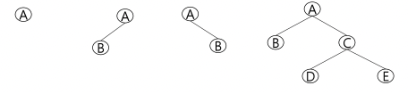
- 레벨 i에서의 노드의 최대 개수는 2\*\*i 개
- 높이가 h인 이진 트리가 가질 수 있는 노드의 최소 개수는 (h + 1)개가 되며, 최대 개수는 (2\*\*(h+1) - 1)개가 된다.

### 포화 이진 트리(Full binary Tree)

- 모든 레벨에 노드가 포화상태로 차 있는 이진 트리
- 높이가 h일 때, 최대의 노드 개수인 (2\*\*(h+1) - 1)개의 노드를 가진 이진 트리
- 루트를 1번으로 하여 2\*\*(h+1) - 1까지 정해진 위치에 대한 노드 번호를 가짐. 레벨이 낮은 걸 왼쪽에서 오른쪽으로 순서대로 번호를 붙인다. 즉 bfs 방식처럼 붙인다고 생각하면 됨

### 완전 이진 트리(Complete Binary Tree)

- 높이가 h이고 노드 수가 n개일 때 (단, h+1 ≤ n ≤ 2(h+1) - 1), 포화 이진 트리의 노드 번호 1번부터 n번까지 빈 자리가 없는 이진 트리

### 편향 이진 트리(Skewed Binary Tree)

- 높이 h에 대한 최소 개수의 노드를 가지면서 한쪽 방향의 자식 노드만을 가진 이진 트리
  - 왼쪽 편향 이진 트리
  - 오른쪽 편향 이진 트리

### 이진 트리의 순회

- 순회(traversal)란 트리의 각 노드를 중복되지 않게 전부 방문(visit)하는 것을 말하는데, 트리는 비선형구조이기 때문에 선형구조에서와 같이 선후 연결 관계를 알 수 없다.
- 3가지의 기본적인 순회 방법

  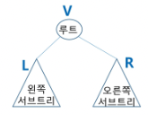

  1. 전위 순회(preorder traversal): VLR

     - 부모노드 방문 후, 자식 노드를 좌, 우 순서로 방문한다

     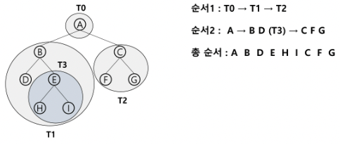

     ```python
     def preorder_traverse(T):
         if T:
             visit(T) # print(T.item)
             preorder_traverse(T.left)
             preorder_traverse(T.right)
     ```

  2. 중위 순회(inorder traversal): LVR

     - 왼쪽 자식노드, 부모노드, 오른쪽 자식노드 순으로 방문한다

     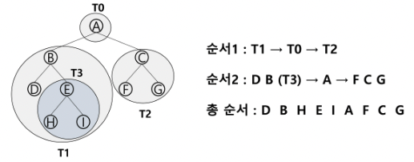

     ```python
     def inorder_traverse(T):
         if T:
             inorder_traverse(T.left)
             visit(T)
             inorder_traverse(T.right)
     ```

  3. 후위 순회(postorder traversal): LRV

     - 자식노드를 좌우 순서로 방문한 후, 부모노드로 방문한다.

     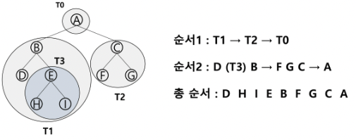

     ```python
     def postorder_traverse(T):
         if T:
             postorder_traverse(T.left)
             postorder_traverse(T.right)
             visit(T)
     ```

### 이진 트리의 표현(배열 이용)

- 이진 트리에 각 노드 번호를 다음과 같이 부여
  - 루트의 번호를 1로 함
  - 레벨 n에 있는 노드에 대하여 왼쪽부터 오른쪽으로 2**n부터 2**(n+1) - 1까지 번호를 차례로 부여
- 노드 번호의 성질
  - 노드 번호가 i인 노드의 부모 노드 번호는 i//2
  - 노드 번호가 i인 노드의 왼쪽 자식 노드 번호는 2\*i
  - 노드 번호가 i인 노드의 오른쪽 자식 노드 번호는 2\*i + 1
  - 레벨 n의 노드 번호 시작 번호는 2\*\*n
- 배열을 이용한 (포화, 완전)이진 트리의 표현
  - 노드 번호를 배열의 인덱스로 사용
  - 높이가 h인 이진 트리를 위한 배열의 크기는 2\*\*(h+1) - 1 (최대 노드 수 기준)
    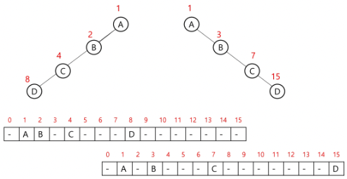
- 배열을 이용한 이진 트리 표현의 단점
  - 편향 이진 트리의 경우에 사용하지 않는 배열 원소에 대한 메모리 공간 낭비 발생
  - 트리의 중간에 새로운 노드를 삽입하거나 기존의 노드를 삭제할 경우 배열의 크기 변경이 어려워 비효율적

### 참고. 배열로 표현한 이진 트리의 저장

- 부모 번호를 인덱스로 자식 번호를 저장
  - 순회시 사용
    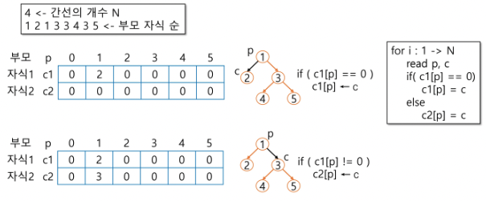
- 자식 번호를 인덱스로 부모 번호를 저장
  - 루트나 조상 찾을 때 사용
    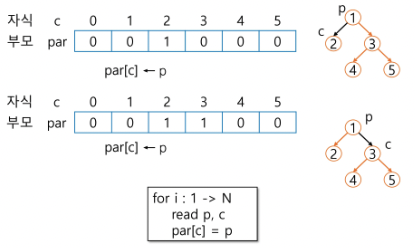
  - 루트 찾기, 조상 찾기
    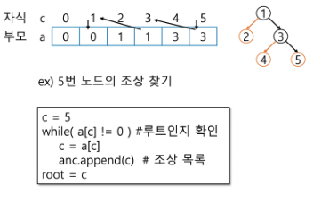

### 이진 트리의 표현(연결 리스트 이용)

- 이진 트리의 모든 노드는 최대 2개의 자식 노드를 가지므로 일정한 구조의 단순 연결 리스트 노드를 사용하여 구현

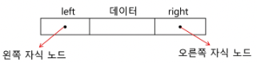

- 완전 이진 트리의 연결 리스트 표현
  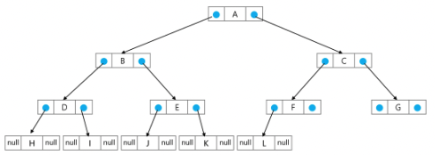

```python
class Node:
    def __init__(self, data):
        self.data = data
        self.left = None
        self.right = None
        # self.parent = None

root_node = Node(0)
node_1 = Node(1)
node_2 = Node(2)

root_node.left = node_1
root_node.right = node_2
# node_1.parent = root_node
# method로 만들어서 사용해도 됨
```

## 수식 트리

- 수식을 표현하는 이진 트리
- 수식 이진 트리(Expression Binary Tree)라고 부르기도 함
- 연산자는 루트 노드이거나 가지 노드
- 피연산자는 모두 잎 노드

## 이진 탐색 트리

- 탐색작업을 효율적으로 하기 위한 자료구조
- 모든 원소는 서로 다른 유일한 키를 갖는다.(중복 x)
  - 조건을 줄 수는 있지만 굳이 그렇게 사용하지 않음
- key(왼쪽 서브트리) < key(루트 노드) < key(오른쪽 서브트리)
- 왼쪽 서브트리와 오른쪽 서브트리도 이진 탐색 트리이다.
- 중위 순회하면 오름차순으로 정렬된 값을 얻을 수 있다.

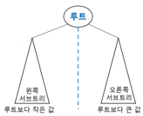

### 이진 탐색 트리 - 탐색연산

- 루트에서 시작한다
- 탐색할 키 값 x를 루트 노드의 키 값과 비교한다.
  - 키 값 x = 루트노드의 키 값인 경우: 원하는 원소를 찾았으므로 탐색연산 성공
  - 키 값 x < 루트노드의 키 값인 경우: 루트노드의 왼쪽 서브트리에 대해서 탐색연산 수행
  - 키 값 x > 루트노드의 키 값인 경우: 루트노드의 오른쪽 서브트리에 대해서 탐색연산 수행
- 서브트리에 대해서 순환적으로 탐색 연산을 반복한다.

### 이진 탐색 트리 - 삽입연산

- 먼저 탐색 연산을 수행
  - 삽입할 원소와 같은 원소가 트리에 있으면 삽입할 수 없으므로, 같은 원소가 트리에 있는지 탐색하여 확인한다.
  - 탐색에서 탐색 실패가 결정되는 위치가 삽입 위치가 된다.
- 탐색 실패한 위치에 원소를 삽입한다.(부등호 조건)

### 이진 탐색 트리의 성능

- 탐색(searching), 삽입(insertion), 삭제(deletion) 시간은 트리의 높이만큼 시간이 걸린다.
  - O(h), h: BST의 높이(height)
    - 이상적인 경우 O(h) == O(logN)일 것
- 평균의 경우
  - 이진 트리가 균형적으로 생성되어 있는 경우
  - O(log n)
- 최악의 경우
  - 한쪽으로 치우친 경사 이진트리의 경우
  - O(n)
  - 순차탐색과 시간복잡도가 같다
- 검색 알고리즘의 비교
  - 배열에서의 순차 검색: O(N)
  - 정렬된 배열에서의 순차 검색: O(N)
  - 정렬된 배열에서의 이진탐색: O(logN)
    - 고정 배열 크기와 삽입, 삭제시 추가 연산 필요
  - 이진 탐색트리에서의 평균: O(logN)
    - 최악의 경우: O(N)
    - 완전 이진 트리 또는 균형트리로 바꿀 수 있다면 최악의 경우를 없앨 수 있다.
      - 새로운 원소를 삽입할 때 삽입 시간을 줄인다
      - 평균과 최악의 시간이 같다(O(logN))
  - 해쉬 검색: O(1)
    - 추가 저장 공간이 필요
- 상용에서 검색을 위해 어떤 알고리즘을 사용할까?

## 참고. 힙(heap)

- 완전 이진 트리로 구현된 자료구조로서, 키 값이 가장 큰 노드나 가장 작은 노드를 찾기에 유용한 자료구조
- 최대 힙의 경우 루트에 키 값이 가장 큰 노드가, 최소 힙의 경우 루트에 키 값이 가장 작은 노드가 위치한다.
- 최대 힙(max heap)
  - 키 값이 가장 큰 노드를 찾기 위한 완전 이진 트리
  - 부모 노드의 키 값 > 자식 노드의 키 값
  - 루트 노드: 키 값이 가장 큰 노드
- 최소 힙(min heap)
  - 키 값이 가장 작은 노드를 찾기 위한 완전 이진 트리
  - 부모 노드의 키 값 < 자식 노드의 키 값
  - 루트 노드: 키 값이 가장 작은 노드

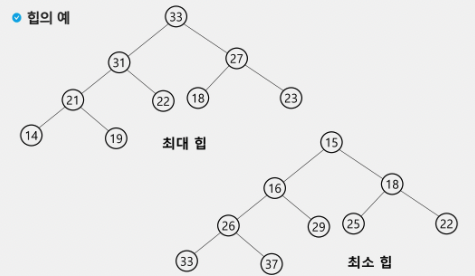

### 힙 연산 - 삽입

1. 마지막 노드의 인덱스 +1 하여 삽입할 자리 확정
   - 완전이진트리의 구조를 유지해야 한다
2. 확정한 자리에 삽입할 원소 저장
3. 삽입한 원소와 부모 노드의 값을 비교하여 필요시 스위치
4. 조건을 만족하거나 더 이상 부모 노드가 없을 때까지 3을 반복

```python
# 최대힙

def enq(n):
    global last
    last += 1          # 마지막 정점 추가
    heap[last] = n     # 마지막 정점에 key 추가

    # 부모가 있고, 부모 < 자식인 경우 자리 교환 (부모가 없거나 부모>자식 조건을 만족할 때까지)
    c = last
    p = c // 2         # 완전이진트리에서 부모 정점 번호
    while p and heap[p] < heap[c]:
        heap[p], heap[c] = heap[c], heap[p]
        c = p
        p = c // 2

heap = [0] * 100       # 배열의 사이즈를 정해두고 구현한다
last = 0

enq(2)
enq(5)
enq(7)
enq(3)
enq(4)
enq(6)
print(heap)
```

### 힙 연산 - 삭제

- 루트 노드의 원소만을 삭제한다.
- 루트 노드의 원소를 삭제하여 반환한다.
- 힙의 종류에 따라 최대값 또는 최소값을 구할 수 있다.

1. 루트 노드의 원소 삭제
2. 마지막 노드의 원소를 루트 노드에 저장 후 마지막 노드 삭제
3. 루트 노드와 자식 노드의 값을 비교하여 필요시 스위치
4. 조건을 만족하거나 더 이상 자식 노드가 없을 때까지 3을 반복

```python
# 최대힙

def deq():
    global last
    tmp = heap[1]          # 루트 백업
    heap[1] = heap[last]   # 삭제할 노드의 키를 루트에 복사
    last -= 1              # 마지막 노드 삭제
    #루트에 옮긴 값을 자식과 비교
    p = 1
    c = p * 2              # left child
    while c <= last:       # 자식이 하나라도 있으면
        # 오른쪽 자식도 있고, 오른쪽 자식이 더 크면 비교 대상을 오른쪽 자식으로 변경
				if c+1 <= last and heap[c] < heap[c+1]:
            c += 1

        if heap[p] < heap[c]:
            heap[p], heap[c] = heap[c], heap[p]
            p = c          # 자식을 새로운 부모로
            c = p * 2      # left child
        else:              # 부모가 더 크면
            break          # 비교 중단
    return tmp

enq(2)
enq(5)
enq(7)
enq(3)
enq(4)
enq(6)
while last:
    print(deq()) # 7 6 5 4 3 2 최대힙이므로 내림차순으로 꺼내짐
```

- 힙의 키를 우선순위로 활용하여 우선순위 큐를 구현할 수 있다.
- python에서는 import heapq 를 통해 사용 가능(최소힙)
