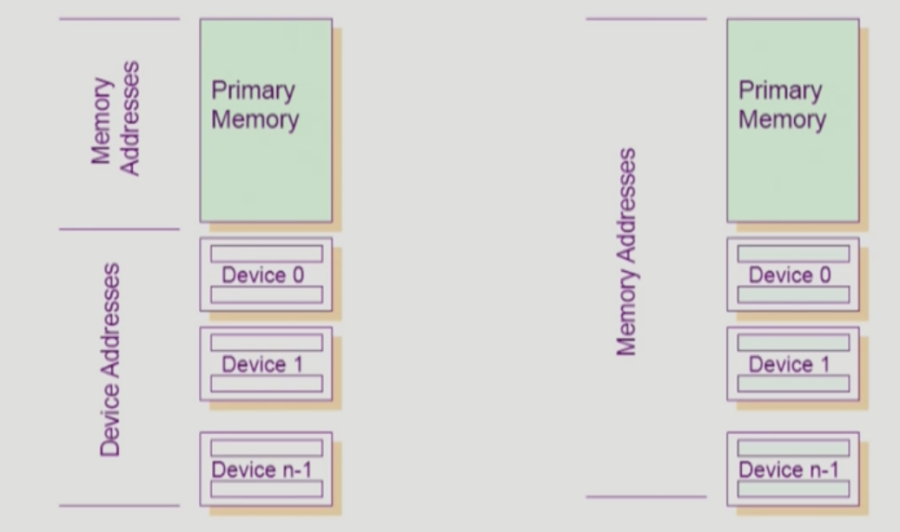
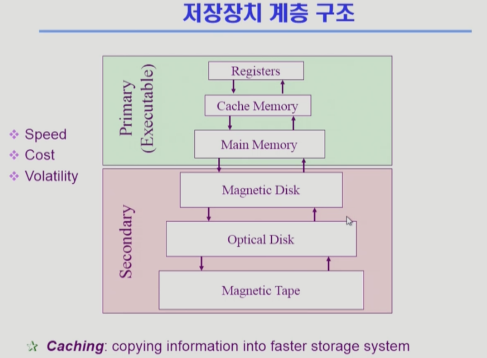
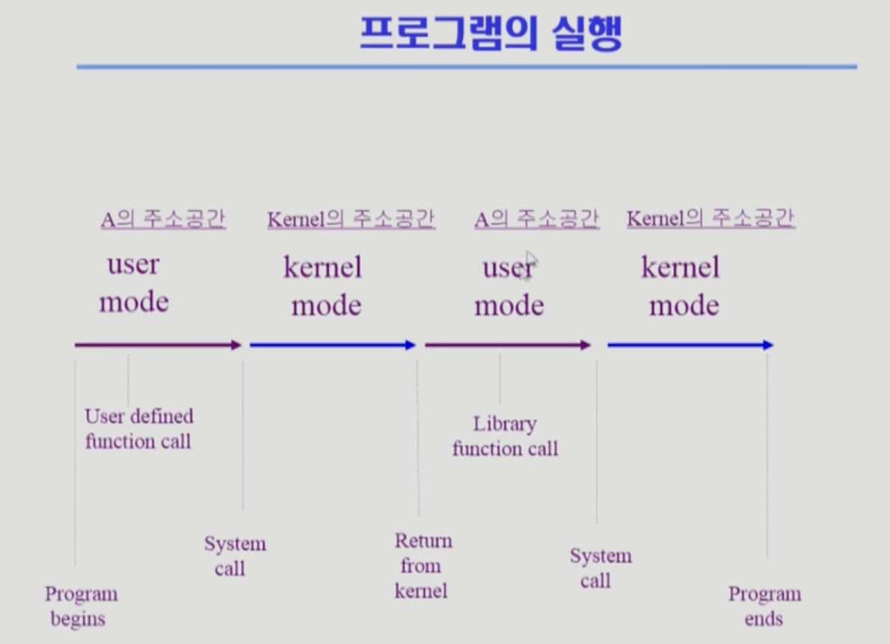

# 운영체제

- 운영체제(Operating System, OS): 컴퓨터 하드웨어 바로 위에 설치되어 사용자 및 다른 모든 소프트웨어와 하드웨어를 연결하는 소프트웨어 계층으로서 모든 컴퓨터 시스템의 필수적인 부분이다
- 운영체제의 목표:
    - 컴퓨터 시스템을 편리하게 사용할 수 있는 환경을 제공
        - 운영체제는 동시 사용자/프로그램드링 각각 독자적 컴퓨터에서 수행되는 것 같은 환상을 제공
        - 하드웨어를 직접 다루는 복잡한 부분을 운영체제가 대행
    - 컴퓨터 시스템의 자원(resource)을 효율적으로 관리
        - 프로세서(cpu), 기억장치(memory), 입출력 장치 등의 효율적 관리
            - 형평성: 사용자간의 형평성 있는 자원 분배
            - 효율성: 주어진 자원으로 최대한의 성능을 내도록
        - 사용자 및 운영체제 자신의 보호
        - 프로세스 , 파일, 메시지 등 소프트웨어 자원을 관리
- 좁은 의미의 운영체제(커널)
    - 운영체제의 핵심 부분으로 컴퓨터 부팅 이후 항상 메모리에 상주하는 부분
    - 전공자 입장에서는 보통 운영체제라고 하면 커널을 의미
- 넓은 의미의 운영체제
    - 커널 뿐 아니라 각종 주변 시스템 유틸리티를 포함한 개념

## 운영체제의 분류

- 동시 작업 가능 여부에 따른 분류
    - 단일 작업(single tasking): 한 번에 하나의 작업만 처리
        - 예. MS-DOS 프롬프트 상에서는 한 명령의 수행을 끝내기 전에 다른 명령을 수행시킬 수 없음
    - 다중 작업(multi tasking): 동시에 두 개 이상의 작업 처리
        - UNIX, MS Windows 등에서는 한 명령의 수행이 끝나기 전에 다른 명령이나 프로그램을 수행할 수 있음
- 사용자의 수에 따른 분류
    - 단일 사용자(single user)
        - MS-DOS, MS Windows
    - 다중 사용자(multi user)
        - UNIX, NT server
- 처리 방식에 따른 분류
    - 일괄 처리(batch processing)
        - 작업 요청의 일정량 모아서 한꺼번에 처리
        - 작업이 완전 종료될 때까지 기다려야 함
        - 예. 초기 Punch Card 처리 시스템
        - 현대 운영체제에서는 찾아보기 어려움
    - 시분할(time sharing)
        - 여러 작업을 수행할 때 컴퓨터 처리 능력을 일정한 시간 단위로 분할하여 사용
        - 일괄 처리 시스템에 비해 짧은 응답 시간을 가짐
        - 일반적인 범용 컴퓨터에서 보통 사용하는 방식
        - 예. UNIX
        - interactive한 방식(입력에 대해 바로바로 응답이 표시됨)
    - 실시간(Realtime OS)
        - 정해진 시간 안에 어떠한 일이 반드시 종료됨이 보장되어야 하는 실시간 시스템을 위한 OS
        - 특수한 목적을 가진 환경에서 사용함
        - 예. 원자로/공장 제어, 미사일 제어, 반도체 장비, 로보트 제어
    - 실시간 시스템의 개념 확장
        - Hard realtime system(경성 실시간 시스템)
            - 데드라인을 지키지 못하면 치명적인 결과가 나옴
            - 위의 반도체나 미사일 같은 경우
        - Soft realtime system(연성 실시간 시스템)
            - 데드라인은 있지만 결과가 치명적이지는 않은 환경에서 실시간 시스템을 사용하는 경우.
            - 예. 영화 상영기 등에 적용할 시 데드라인을 못 지켜도 결과가 치명적이지는 않다
            - 실시간 OS가 필요한 응용프로그램들이 늘어나고 있기 때문에 확장. 예를 들어 휴대폰의 자동차 네비게이션 어플리케이션
- 현대의 OS는 대부분 multi tasking 지원, multi user 지원, 시분할 방식으로 동작함
- 참고. 용어의 구분
    - Multitasking: 컴퓨터에서 여러 작업을 동시에 수행하는 것을 뜻함
    - Multiprogramming: 여러 프로그램이 메모리에 올라가 있음을 강조
    - Time sharing: CPU의 시간을 분할하여 나누어 쓴다는 의미를 강조
    - Multiprocess: 하나의 컴퓨터에 CPU(processor)개 붙어 있음을 의미

# 컴퓨터 구조

## 컴퓨터 시스템 구조

- Computer
    - CPU
        - CPU는 Memory랑만 일한다
        - register
        - mode bit
            - mode bit을 통해 하드웨어적으로 두 가지 모드의 operation 지원
                - 사용자 모드(1): 사용자 프로그램 수행
                - 모니터 (커널, OS) 모드(0): OS 코드 수행
            - 사용자 프로그램의 잘못된 수행으로 다른 프로그램 및 운영체제에 피해가 가지 않도록 하기 위한 보호 장치
            - 보안을 해칠 수 있는 중요한 명령어는 모니터 모드에서만 수행 가능한 ‘특권 명령'으로 규정
        - interrupt line: timer에 세팅된 시간이 지나면 interrupt라인에 알려줌. CPU는 하나의 실행이 끝날 때마다 interrupt line을 확인한다. timer 시간이 초과하면 CPU 권한이 자동으로 OS로 넘어옴(그렇게 설계됨)
    - Memory
        - memory controller: CPU와 DMA controller가 동시에 메모리에 접근하는 것을 방지 및 제어
    - DMA(direct memory access) controller
        - 직접 메모리에 접근할 수 있는 컨트롤러(원래 메모리에는 CPU만 접근 가능)
        - I/O 장치의 interrupt가 너무 자주 발생하면 CPU 효율이 떨어짐. DMA controller가 I/O의 interrupt에 대해 local buffer의 내용을 메모리에 쓰는 것까지 해 준 뒤 CPU에 interrupt를 한 번만 걸어줘서 CPU 효율 증가
    - timer
        - 특정 프로그램이 CPU를 독점하는 것을 막기 위한 장치
        - 정해진 시간이 흐른 뒤 운영체제에게 제어권이 넘어가도록 인터럽트를 발생시킴
- I/O Device
    - Disk
    - Moniter, Keyboard, Mouse, Printer, etc.
    - 각 디바이스에는 device controller들이 붙어 컨트롤함(CPU와 유사한 역할)
        - I/O divecie controller
            - 해당 I/O 장치유형을 관리하는 일종의 작은 CPU
            - 제어 정보를 위해 control register, status register를 가짐
            - lacal buffer를 가짐 (일종의 data register로 memory와 유사한 일종의 작업공간 역할)
            - Divece controller는 I/O가 끝났을 경우 interrupt로 CPU에 그 사실을 알림

### 입출력(I/O)의 수행

- 모든 입출력 명령은 특권 명령(모니터 모드에서만 가능)
- 사용자 프로그램은 어떻게 I/O를 하는가?
    - System Call: 사용자 프로그램이 운영체제에게 I/O 요청
    - Interrupt line을 쓰는 방식으로 진행된다. 자세한 내용은 해당 챕터에서 다룸. 아래는 개괄
        - trap을 사용하여 인터럽트 벡터의 특정 위치로 이동
        - 제어권이 인터럽트 벡터가 가리키는 인터럽트 서비스 루틴으로 이동
        - 올바른 I/O 요청인지 확인 후 I/O 수행
        - I/O 완료시 제어권을 시스템콜 다음 명령으로 옮김

### 인터럽트

- 인터럽트가 발생하면 인터럽트 당한 시점의 레지스터와 program counter를 저장한 후 CPU의 제어를 인터럽트 처리 루틴에 넘긴다
- 인터럽트라고 하면 보통 하드웨어 인터럽트 즉 하드웨어가 발생시킨 인터럽트를 가리킨다.
- 소프트웨어 인터럽트는 Trap이라고 부른다.
    - Exeption: 프로그램이 오류를 범한 경우
    - System call: 사용자 프로그램이 운영체제의 서비스를 받기 위해 커널 함수를 호출하는 경우
- 인터럽트 관련 용어
    - 인터럽트 벡터: 해당 인터럽트의 처리 루틴 주소를 가지고 있음
    - 인터럽트 처리 루틴(Interrupt Service Routine, 인터럽트 핸들러): 해당 인터럽트를 처리하는 커널 함수
- 현대의 운영체제는 인터럽트에 의해 구동됨

### 동기식 입출력과 비동기식 입출력

- 프로세스 기준으로 I/O가 끝날 때까지 instruction을 수행하지 못하면 동기식, 그렇지 않으면 비동기식이다. 이때 CPU는 해당 프로세스가 들고 있을 수도 있고(구현 방법 1) 다른 프로세스나 OS에게 CPU를 넘겨줄 수도 있다(구현 방법 2)
- 동기식 입출력 (synchronous I/O)
    - I/O 요청 후 입출력 잡업이 완료된 후에야 제어가 사용자 프로그램에 넘어감
    - 구현 방법 1
        - I/O가 끝날 때까지 CPU를 낭비시킴
        - 매시점 하나의 I/O만 일어날 수 있음
    - 구현 방법 2
        - I/O가 완료될 때까지 해당 프로그램에게서 CPU를 빼앗음
        - I/O가 처리를 기다리는 줄에 그 프로그램을 줄 세움
        - 다른 프로그램에서 CPU를 줌
- 비동기식 입출력 (asynchronous I/O)
    - I/O가 시작된 후 입출력 작업이 끝나기를 기다리지 않고 제어가 사용자 프로그램에 즉시 넘어감
- 두 경우 모두 I/O의 완료는 인터럽트로 알려줌

### DMA(Diract Memory Access)

- 빠른 입출력 장치를 메모리에 가까운 속도로 처리하기 위해 사용
- CPU의 중재 없이 device controller가 device의 buffer storage의 내용을 메모리에 block 단위로 직접 전송
- 바이트 단위가 아니라 block 단위로 인터럽트를 발생시킴

### 서로 다른 입출력 명령어

- I/O를 수행하는 special instruction에 의해
- Memory Mapped I/O에 의해

  

 

## 저장장치 계층 구조

- Primary(Executable) Storage
    - CPU가 직접 접근해서 사용 가능(byte 단위로 접근)
- Secondary Storage
    - CPU가 직접 접근해서 사용 불가능(sector 단위로 접근)

  

- 위로 갈수록 속도가 빠른 매체를 사용, 단위당 코스트가 비싸 용량이 작음
- 현대에서 일부 다르기도 하지만 전통적으로 primary는 휘발성, secondary는 비휘발성

 

## 프로그램의 실행(메모리 load)

- 프로그램은 실행파일 형태로 하드디스크의 파일 시스템(File system)에 저장이 되어 있다.
- 실행 파일을 실행시키면 그를 위한 독자적인 주소 공간이 만들어진다.
    - Virtual memory, code-data-stack으로 구성
- 이후  물리적인 메모리(Physical memory)로 올라가서 프로세스가 됨. 이때 실행에 필요한 부분은 실제 메모리에 올라가서 실행되고, 당장 불필요한 부분은 하드디스크의 Swap area에 둔다.

 

## 커널 주소 공간의 내용

- code
    - 커널 코드
        - 시스템콜, 인터럽트 처리 코드
        - 자원 관리를 위한 코드
        - 편리한 서비스 제공을 위한 코드
- data
    - 운영체제가 사용하는 여러 자료구조들이 존재
        - CPU, Memory, disk 등 하드웨어들을 관리하기 위한 자료구조
        - 실행 중인 프로세스를 관리하기 위한 자료구조(PCB)
- stack
    - 프로세스의 커널 스택이 쌓여 관리됨

 

## 사용자 프로그램이 사용하는 함수

- 사용자 정의 함수
    - 유저가 프로그램에서 정의한 함수
- 라이브러리 함수
    - 유저가 자신의 프로그램에서 정의하지 않고 가져다 쓰는 함수
    - 프로그램의 실행 파일에 포함되어 있음
- 커널 함수
    - 운영체제 프로그램의 함수
    - 커널 함수의 호출 == 시스템 콜

### 프로그램의 실행

- 프로그램은 유저 모드와 커널 모드를 반복하면서 실행된다

  
