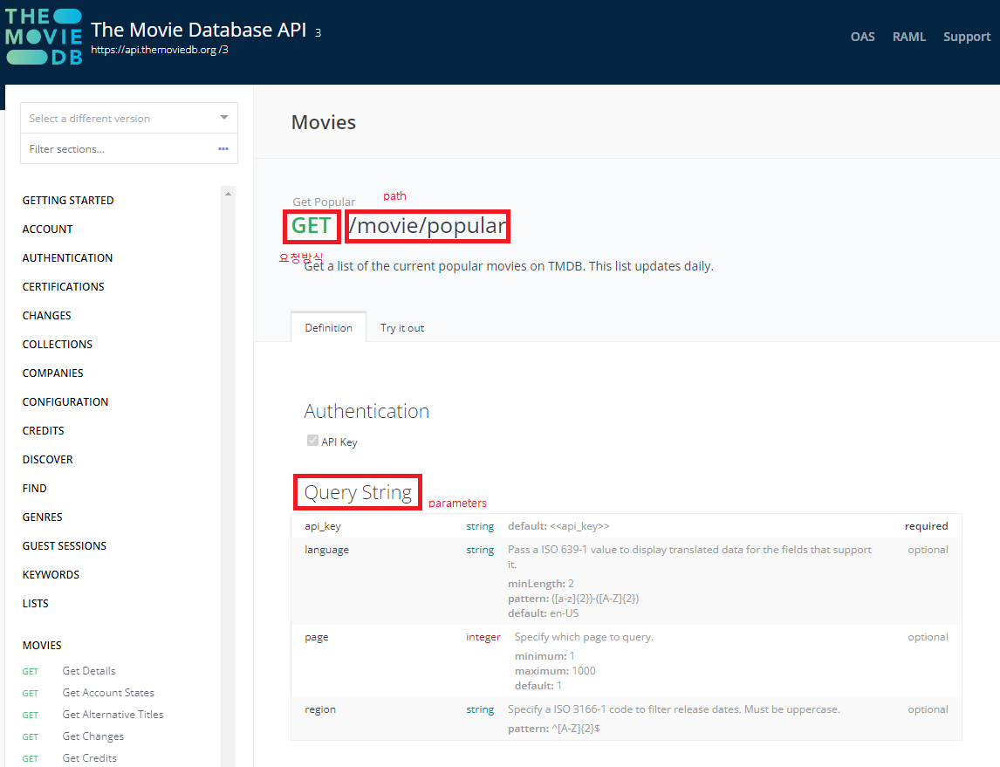

### API(Application Program Interface)

- 프로그램과 프로그램 사이에서 상호작용을 할 수 있도록 해 주는 것
- 정보를 주고 받을 수 있다.
- 상호작용은 대부분 요청과 응답으로 이루어져 있다. API를 이용해 상호작용을 한다.
- url로 요청, json(또는 xml, html 등 다른 형식)으로 응답

### URL(Uniform Resource Locator)

- URI
- URL(location)
- URN(name)

http://www.example.com:80/path/to/myfile.html?key1=value1&key2=value2#

- Scheme - http
    - http와 https의 차이 - secure
- Domain Name - www.example.com
    - 서버 주소
- Port - 80
- Path to the file - path/to/myfile.html
    - 해당 주소 안의 디테일한 정보
- Parameters - ?key1=value1&key2=value2
    - ?로 시작
    - path에 대한 설명
    - 필수적인 key(서버 접속 권한 등)가 있고 선택적인 key(어떤 언어로 줄지 등)가 있다
- Anchor

### json 구조 확인법

1. api 문서 확인
2. 브라우저로 url 접속해서 확인 (json viewer 사용하면 좋음)
3. 터미널에서 확인

### 가상환경 사용해보고 싶을 때

`python -m venv venv`

`pip list` 확인해서 필요한 작업 진행

git에 올릴 때 .gitignore 조심할 것