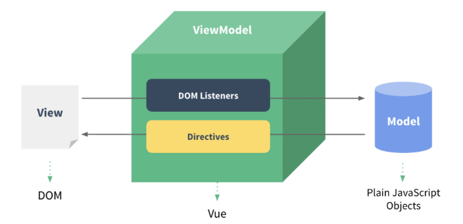
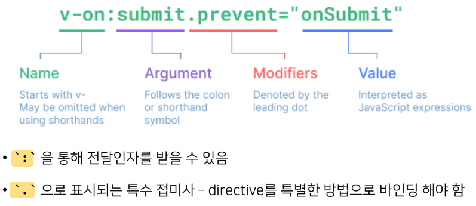

## Vue instance

### MVVM Pattern

- 소프트웨어 아키텍처 패턴의 일종
- 마크업 언어로 구현하는 그래픽 사용자 인터페이스(view)의 개발을 백엔드(model)로부터 분리시커 view가 어느 특정한 모델 플랫폼에 종속되지 않도록 함
- View: 우리 눈에 보이는 부분 = DOM
- Model: 실제 데이터 = JSON
- View Model (Vue)
  - View를 위한 Model
  - View와 연결(binding)되어 Action을 주고 받음
  - Model이 변경되면 View Model도 변경되고 바인딩된 View도 변경됨
  - View에서 사용자가 데이터를 변경하면 View Model의 데이터가 변경되고 바인딩된 다른 View도 변경됨

### el(element)

- Vue instance와 DOM을 mount(연결)하는 옵션
  - View와 Model을 연결하는 역할
  - HTML id 혹은 class와 마운트 가능
- Vue instance와 연결된 DOM의 외부는 Vue의 영향을 받지 않음
  - Vue 속성 및 메서드 사용 불가

### data

- Vue instance의 데이터 객체 혹은 인스턴스 속성
- 데이터 객체는 반드시 object( {} )여야 함
- 객체 내부의 아이템들은 value로 모든 타입의 객체를 가질 수 있음
- 정의 된 속성은 interpolation ( {{}} )을 통해 view에 렌더링 가능함
- data 객체에 정의된 값들은 Vue instance 의 property로 등록된다.

### methods

- Vue instance의 method들을 정의하는 곳
- method 객체 정의
- method를 호출하여 data 변경 가능
  - 주의. 메서드를 정의할 때, 화살표 함수를 사용하면 안 된다. 화살표 함수는 this를 가지지 않기 때문에 화살표 함수 내부의 this는 일반적인 다른 변수들과 똑같이 취급되고, 따라서 뷰 인스턴스 내부에서 this 바인딩이 제대로 이루어지지 않는다. this 값은 해당하는 객체를 찾을 때까지 상위 스코프를 따라 이동하고 이는 에러를 발생시킬 수 있다.

## Vue basic syntax

### Template Syntax

- Vue2 guide > template syntax 참고
- 렌더링 된 DOM을 기본 Vue instance의 data에 선언적으로 바인딩할 수 있는 HTML 기반 template syntax를 사용
  - 렌더링 된 DOM - 브라우저에 의해 보기 좋게 그려질 HTML 코드
  - HTML 기반 tempalte syntax - HTML 코드에 직접 작성할 수 있는 문법 제공
  - 선언적으로 바인딩 - Vur instance와 DOM을 연결

### Template Interpolation

- 가장 기본적인 바인딩(연결) 방법
- 중괄호 2개로 표기
- Template interpolation 방법은 HTML을 일반 텍스트로 표현
- 표현식 형태로 작성 가능

### RAW HTML

- v-html directive를 사용하여 data와 바인딩
- directive - HTML 기반 template syntax
- HTML의 기본 속성이 아닌 Vue가 제공하는 특수 속성의 값으로 data를 작성
- HTML 태그의 attribute로 v-html을 지정하고 Vue instance의 data 객체의 rawHTML 키를 이용해 원하는 값을 지정함

## Directives

### Directives 기본 구성

- v- 접두사가 있는 특수 속성에는 값을 할당할 수 있음
  - 값에는 JS 표현식을 작성할 수 있음
- directive의 역할은 표현식의 값이 변경될 때 반응적으로 DOM에 적용하는 것

- v-text
  - Template Interpolation과 함께 가장 기본적인 바인딩 방법
  - {{ }} 와 동일한 역할 (정확히 동일한 역할인 것은 아님)
- v-html
  - RAW HTML을 표현할 수 있는 방법
  - 단, 사용자가 입력하거나 제공하는 컨텐츠에는 절대 사용 금지 (XSS 공격 가능)
- v-show
  - 표현식에 작성된 값에 따라 element를 보여줄 것인지 결정
    - boolean 값이 변경될 때마다 반응
  - 대상 element의 display 속성을 기본 속성과 none으로 toggle
  - 요소 자체는 항상 DOM에 렌더링 됨
  - 화면에서만 사라졌을 뿐(display 속성이 변경되었을 뿐), DOM에는 존재한다
- v-if
  - v-show와 사용 방법은 동일
  - 단, 값이 false인 경우 DOM에서 사라짐
  - v-if v-else-if v-else 형태로 사용
- v-show vs. v-if
  - v-show (Expensive initial load, cheap toggle)
    - 표현식 결과와 관계 없이 렌더링 되므로 초기 렌더링에 필요한 비용은 v-if보다 높을 수 있음
    - display 속성 변경으로 표현 여부를 판단하므로 렌더링 후 toggle 비용은 적음
  - v-if (Cheap initial load, expensive toggle)
    - 표현식 결과가 false인 경우 렌더링조차 되지 않으므로 초기 렌더링 비용은 v-show 보다 낮을 수 있음
    - 단, 표현식 값이 자주 변경되는 경우 잦은 재 렌더링으로 비용이 증가할 수 있음
- v-for
  - for … in … 형식으로 작성
  - 반복한 데이터 타입에 모두 사용 가능
  - index를 함께 출력하고자 한다면 (char, index) 형태로 사용 가능
  - 배열 역시 문자열과 동일하게 사용 가능
  - 각 요소가 객체라면 dot notation으로 접근할 수 있음
  - 참고. 특수 속성 key
    - v-for 사용시 반드시 key 속성을 각 요소에 작성
    - 주로 v-for directive 작성시 사용
    - Vue 화면 구성시 이전과 달라진 점을 확인하는 용도로 활용 (따라서 key가 중복되어서는 안 됨)
    - 각 요소가 고유한 값을 가지고 있지 않다면 생략할 수 있음
  - 객체 순회시 value가 할당되어 출력
  - 두번째 변수 할당시 key 출력 가능
- v-on
  - : 을 통해 전달받은 인자를 확인
  - 값으로 JS 표현식 작성
  - addEventListener 의 첫 번째 인자와 동일한 값들로 구성
  - 대기하고 있던 이벤트가 발생하면 할당된 표현식 실행
  - method를 통한 data 조작도 가능
  - method에 인자를 넘기는 방법은 일반 함수를 호출할 때와 동일한 방식
  - : 을 통해 전달된 인자에 따라 특별한 modifiers(수식어)가 있을 수 있음
    - ex) v-on:keyup.enter 등
  - @ shortcut 제공
    - ex) @keyup.click
- v-bind
  - HTML 기본 속성에 Vue data를 연결
  - class의 경우 다양한 형태로 연결 가능
    - 조건부 바인딩
      - {’class Name’: ‘조건 표현식’}
      - 삼항 연산자도 가능
    - 다중 바인딩
      - [’JS 표현식’, ‘JS 표현식’, …]
  - Vue data의 변화에 반응하여 DOM에 반영하므로 상황에 따라 유동적 할당 가능
  - : shortcut 제공
    - ex) :class 등
    - v-for에서 사용하였던 :key는 v-bind의 shortcut을 활용한 것
- v-model
  - Vue instance와 DOM의 양방향 바인딩
  - Vue data 변경 시 v-model로 연결된 사용자 입력 element에도 적용

## Vue advanced

### computed

- Vue instance가 가진 options 중 하나
- computed 객체에 정의한 함수를 페이지가 최초로 렌더링될 때 호출하여 계산
  - 계산 결과가 변하기 전까지 함수를 재호출하는 것이 아닌 계산된 값을 반환

### method vs. computed

- method
  - 호출될 때마다 함수를 실행
  - 같은 결과여도 매번 새롭게 계산
- computed
  - 함수의 종속 대상의 변화에 따라 계산 여부가 결정됨
  - 종속 대상이 변하지 않으면 항상 저장(캐싱)된 값을 반환

### watch

- 특정 데이터의 변화를 감지하는 기능
  1. watch 객체를 정의
  2. 감시할 대상 data를 지정
  3. data가 변할 시 실행할 함수를 정의
- 첫 번째 인자는 변동 전 data
- 두 번째 인자는 변동 후 data
- 실행 함수를 Vue method로 대체 가능
  1. 감시 대상 data의 이름으로 객체 생성
  2. 실행하고자 하는 method를 handler에 문자열 형태로 할당
- Array, Object의 내부 요소 변경 감지를 위해서는 deep 속성 추가 필요

### filters

- 텍스트 형식화를 적용할 수 있는 필터
- interpolation 혹은 v-bind를 이용할 때 사용 가능
- 필터는 자바스크립트 표현식 마지막에 |(파이프)와 함께 추가되어야 함
- 체이닝 가능
