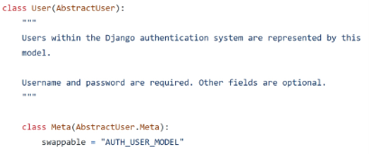
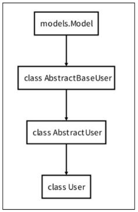

# The Django authentication system

- Django authentication system(인증 시스템)은 인증(Authentication)과 권한(Authorization) 부여를 함께 제공(처리)하며, 이러한 기능을 일반적으로 인증 시스템이라고 함(이번에는 인증과 권한 부여 중 인증 내용만 있음)
  - Authentication(인증)
    - 신원 확인
    - 사용자가 자신이 누구인지 확인하는 것
  - Authorization(권한, 허가)
    - 권한 부여
    - 인증된 사용자가 수행할 수 있는 작업을 결정
- Django의 인증 관련 필수 구정은 settings.py에 이미 포함되어 있으며(django.contrib.auth) INSTALLED_APPS에서 확인 가능
- auth와 관련한 경로나 키워드들을 Django 내부적으로 accounts라는 이름으로 사용하고 있기 때문에 되도록 accounts라는 이름으로 앱을 만들어 사용하는 것을 권장
  - `python manage.py startapp accounts`
  - INSTALLED_APPS에 app name 추가

## Substituting a custom User model

- Custom User Model로 대체하기
- Django는 기본적인 인증 시스템과 여러가지 필드가 포함된 User Model을 제공하고, 대부분의 개발 환경에서 기본 User Model을 Custom User Model로 대체하여 사용한다.
- 개발자들이 작성하는 일부 프로젝트에서는 django가 제공하는 built-in User model의 기본 인증 요구사항이 적절하지 않을 수 있다. 예를 들어 회원가입시 username이 아니라 email을 식별 값으로 사용하고자 하는 경우
- Django는 현재 프로젝트에서 사용할 User Model을 결정하는 AUTH_USER_MODEL 설정 값으로 Default User Model을 재정의(override)할 수 있도록 함
- 커스텀 유저 모델은 기본 유저 모델과 동일하게 작동하면서도 필요한 경우 나중에 맞춤 설정할 수 있기 때문에, 장고에서는 커스텀 유저 모델을 설정하는 것을 강력하게 권장한다.

### AUTH_USER_MODEL

- 프로젝트에서 User를 나타낼 때 사용하는 모델
- 프로젝트가 진행되는 동안(모델을 만들고 마이그레이션 한 후 ) 변경할 수 없음
- 프로젝트 시작시 설정하기 위한 것이며, 참조하는 모델은 첫 번째 마이그레이션에서 사용할 수 있어야 함. **즉 첫번째 마이그레이션 전에 확정지어야 하는 값**
- 프로젝트 중간에 AUTH_USER_MODEL을 변경하려고 하면 모델 관계에 영향을 미치기 때문에 훨씬 더 어려운 작업이 필요. 예를 들면 변경사항이 자동으로 수행될 수 없기 때문에 DB스키마를 직접 수정하고, 이전 사용자 테이블에서 데이터를 이동하고, 일부 마이그레이션을 수동으로 다시 적용해야 하는 등등
- 결론적으로 중간 변경은 권장하지 않고 프로젝트 처음에 진행할 것!
- default value는 ‘auth.User’임

### How to substitute a custom User model

1. AbstractUser를 상속받는 커스텀 User 클래스 작성

   ```python
   from django.contrib.auth.models import AbstractUser

   class User(AbstractUser):
       pass
   ```

   - 기존 User 클래스도 AbstractUser를 상속받기 때문에 커스텀 User 클래스도 완전히 같은 모습을 가지게 됨
   - built-in User model은 사실상 override하여 사용하도록 만들어진 모습임
     

2. Django 프로젝트에서 User를 나타내는 데 사용하는 모델을 방금 생성한 커스텀 User 모델로 지정

   ```python
   # settings.py

   AUTH_USER_MODEL = 'accounts.User'
   ```

3. admin.py에서 커스텀 User 모델을 등록
   - 기본 User 모델이 아니기 때문에 등록하지 않으면 admin site에 출력되지 않음
   - admin site에 기본적으로 표시되는 내용들 커스텀 유저 모델로 연결시킴

### 참고. User 모델 상속 관계



### 참고. Abstract base classes (추상 기본 클래스)

- 몇 가지 공통 정보를 여러 다른 모델에 넣을 때 사용하는 클래스
- 데이터베이스 테이블을 만드는 데 사용되지 않으며, 대신 다른 모델의 기본 클래스로 사용되는 경우 해당 필드가 하위 클래스의 필드에 추가됨
- AbstractUser는 관리자 권한과 함께 완전한 기능을 가지고 있는 User model을 구현하는 추상 기본클래스이다.
