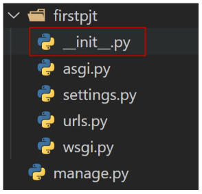

# Django (Python Framework)

## 웹

### WWW(World Wide Web)

- 인터넷이란 전 세계에 퍼져 있는 거미줄 같은 연결망이다.
- 전 세계는 아주 두껍고 튼튼한 해저케이블로 연결되어 있다
- 촘촘하고 거대한 유선으로 연결된 전세계적 네트워크에서 많은 전봇대를 거쳐 인터넷이 연결됨
- 유선 연결의 한계를 극복하기 위한 무선 연결 프로젝트: 스타링크 프로젝트(Space X)
  - 지구를 아주 많은 소형 위성으로 감싸서 케이블이 아닌 위성끼리 데이터를 교환
  - Starlink Train, 우주 쓰레기 등 문제점

### 클라이언트-서버 구조

- 오늘날 우리가 사용하는 대부분의 웹 서비스는 클라이언트-서버 구조를 기반으로 동작
- 어떠한 자원(resource)를 달라고 요청(request)하는 쪽을 클라이언트라고 하고 자원을 제공(response)해주는 쪽을 서버(server)라고 함

### 웹 브라우저

- 웹에서 페이지를 찾아 보여주고, 사용자가 하이퍼링크르 통해 다른 페이지로 이동할 수 있도록 하는 프로그램
- 웹 페이지 파일을 우리가 보는 화면으로 바꿔주는(렌더링, rendering) 프로그램
- HTML / CSS / JS 등의 코드를 읽어 사람이 볼 수 있는 화면으로 만들어 줌(렌더링)

### 웹 페이지

- 웹에 있는 문서
- 정적 웹 페이지(Static Web Page)
  - 있는 그대로를 제공하는 것(served as-is)
  - 한 번 작성된 HTML 파일의 내용이 변하지 않고 모든 사용자에게 동일한 모습으로 전달되는 것
- 동적 웹 페이지(Dynamic Web Page)
  - 사용자의 요청에 따라 웹 페이지에 추가적인 수정이 되어 클라이언트에게 전달되는 웹 페이지
  - 웹 페이지의 내용을 바꿔주는 주체 == 서버

<br>

## Framework?

- 자주 사용되는 부분들을 재사용할 수 있게 좋은 구조로 만들어둔 코드들을 모아놓은 것
- 즉 서비스 개발에 필요한 기능들을 미리 구현해서 모아 놓은 것이 프레임워크이다.
- 프레임워크는 특정 프로그램을 개발하기 위한 여러 도구들과 규약들을 제공한다.
- 프레임워크를 잘 사용하면 소프트웨어의 생산성과 품질을 높일 수 있다.

### Framework의 성격

- 독선적(Opinionated)
  - 독선적인 프레임워크들은 어떤 특정 작업을 다루는 ‘올바른 방법’에 대한 분명한 의견(규약)을 가지고 있음
  - 대체로 특정 문제 내에서 빠른 개발방법을 제시
  - 어떤 작업에 대한 올바른 방법이란 보통 잘 알려져 있고 문서화가 잘 되어 있기 때문
  - 하지만 주요 상황을 벗어난 문제에 대해서는 그리 유연하지 못한 해결책을 제시할 수 있음
- 관용적(Unopinionated)
  - 관용적인 프레임워크들은 구성요소를 한데 붙여서 해결해야 한다거나 심지어 어떤 도구를 써야 한다는 ‘올바른 방법’에 대한 제약이 거의 없음
  - 이는 개발자들이 특정 작업을 완수하는 데 가장 적절한 도구들을 이용할 수 있는 자유도가 높음
  - 하지만 개발자 스스로가 그 도구들을 찾아야 한다는 수고가 필요
- Django는 ‘다소 독선적’

<br>

## Design Pattern

- 디자인 패턴?
  - 다수의 엔지니어들이 일반화된 패턴으로 소프트웨어 개발을 할 수 있도록 한 규칙, 커뮤니케이션의 효율성을 높이는 기법
  - 각기 다른 기능을 가진 다양한 응용 소프트웨어를 개발할 때 공통적인 설계 문제가 존재하며, 이를 처리하는 해결책 사이에도 공통점이 있다는 것을 발견
  - 자주 사용되는 소프트웨어의 구조를 일반적인 구조화를 해둔 것을 디자인 패턴이라고 한다.
  - 프로그래머가 어플리케이션이나 시스템을 디자인할 때 발생하는 공통된 문제들을 해결하는 데 형식화 된 가장 좋은 관행
- 디자인 패턴의 목적
  - 특정 문맥에서 공통적으로 발생하는 문제에 대해 재사용 가능한 해결책을 제시함
- 디자인 패턴의 장점
  - 디자인 패턴을 알고 있다면 서로 복잡한 커뮤니케이션이 매우 간단해짐
- Django의 디자인 패턴: MTV

### MVC

- Model - View - Controller
  - Model: 데이터와 관련된 로직을 관리
  - View: 레이아웃과 화면을 처리
  - Controller: 명령을 model과 view 부분으로 연결
- 각 부분을 독립적으로 개발할 수 있어, 하나를 수정하고 싶을 때 모두 건드리지 않아도 됨
- 따라서 개발 효율성 및 유지보수가 쉬워짐
- 다수의 멤버로 개발하기 용이함

### MTV(Django의 디자인 패턴)

- MVC 디자인 패턴을 기반으로 조금 변형된 패턴
  - MVC (Model - View - Controller)
  - MTV (Model - Template - View) \*\*용어 헷갈리지 않도록 주의할 것!
- Model
  - 데이터와 관련된 로직을 관리
  - 응용프로그램의 데이터 구조를 정의하고 데이터베이스의 기록을 관리
- Template
  - 레이아웃과 화면을 처리
  - 화면상의 사용자 인터페이스 구조와 레이아웃을 정의
  - MVC 패턴에서 View의 역할에 해당
- View
  - Model & Template과 관련한 로직을 처리해서 응답을 반환
  - Model 에 있는 데이터를 가져와 가공해 Template에게 전달
  - 클라이언트의 요청에 대해 처리를 분기하는 역할
  - MVC 패턴에서 Controller의 역할에 해당
- Django MTV 구조(출처 - MDN)


<br>

## Django 실습

### Project & Application

- Project
  - “collections of apps”
  - 프로젝트는 앱의 집합
  - 프로젝트에는 여러 앱이 포함될 수 있음
  - 앱은 여러 프로젝트에 있을 수 있음
- Application
  - 앱은 실제 요청을 처리하고 페이지를 보여주는 등의 역할을 담당
  - 일반적으로 앱은 하나의 역할 및 기능 단위로 작성하는 것을 권장함

### 프로젝트 생성

- 프로젝트 이름에는 파이썬이나 쟝고에서 사용 중인 키워드 및 하이픈(-) 사용 불가
- 프로젝트 구조
  
  - \_\_init\_\_.py
    - Python에게 이 디렉토리를 하나의 Python 패키지로 다루도록 지시
    - 별도로 추가 코드를 작성하지 않음
  - asig.py
    - Asynchronous Server Gateway Interface
    - Django 애플리케이션이 비동기식 웹 서버와 연결 및 소통하는 것을 도움
    - 배포 시 사용
  - settings.py
    - Django 프로젝트 설정을 관리
  - urls.py
    - 사이트의 url과 적절한 views의 연결을 지정
  - wsgi.py
    - Web Server Gateway Interface
    - Django 애플리케이션이 웹 서버와 연결 및 소통하는 것을 도움
    - 배포 시 사용
  - manage.py
    - Django 프로젝트와 다양한 방법으로 상호작용하는 커맨드라인 유틸리티(명령어 모음)
    - manage.py 를 통해 django 프로젝트에 명령한다.

### 애플리케이션 생성

- 일반적으로 애플리케이션 이름은 복수형으로 작성하는 것을 권장
- 애플리케이션 구조
  
  - \_\_init\_\_.py
    - Python에게 이 디렉토리를 하나의 Python 패키지로 다루도록 지시
    - 별도로 추가 코드를 작성하지 않음
  - admin.py
    - 관리자용 페이지를 설정하는 곳
  - apps.py
    - 앱의 정보가 작성된 곳
    - 앱별 개별 설정 등을 한다
  - models.py
    - 애플리케이션에서 사용하는 Model을 정의하는 곳
    - MTV 패턴의 M에 해당
  - tests.py
    - 프로젝트의 테스트 코드를 작성하는 곳
  - veiws.py
    - view 함수들이 정의되는 곳
    - MTV 패턴의 V에 해당

### 애플리케이션 등록

- 프로젝트에서 앱을 사용하기 위해서는 반드시 settings.py 안의 INSTALLED_APPS 리스트에 추가해야 함
- 리스트에 추가하는 순서는
  1. 내가 직접 만든 앱
  2. 3rd party 앱
  3. django 내장 앱
  이 되도록 한다.
- 반드시 생성 후 등록해야 한다. INSTALLED_APPS에 먼저 작성(등록)하고 생성하려고 하면 앱이 생성되지 않음
- INSTALLED_APPS
  - Django installation에 활성화 된 모든 앱을 지정하는 문자열 목록
  

### 요청과 응답

- render(request, template_name, context)
  - 주어진 템플릿을 주어진 컨텍스트 데이터와 결합하고 렌더링 된 텍스트와 함께 HttpResponse(응답) 객체를 반환하는 함수
  - request: 응답을 생성하는 데 사용되는 요청 객체
  - templat_name: 템플릿의 전체 이름 또는 템플릿 이름의 경로
  - context(optional): 템플릿에서 사용할 데이터 (딕셔너리 타입으로 작성)
- templates
  - 실제 내용을 보여주는 데 사용되는 파일
  - 파일의 구조나 레이아웃을 정의
  - template 파일들의 기본 경로는 앱 폴더 안의 templates 폴더 (app_name/templates/)
    - 템플릿 폴더 이름은 반드시 templates라고 지정해야 함
- 코드 작성 순서
  - **데이터의 흐름 순서**!
  
  - 앞으로 Django에서의 코드 작성은 URL → View → Template 순(데이터의 흐름 순)으로 작성
- 추가 설정(참고)
  - LANGUATE_CODE
  - TIME_ZONE

<br>

## Django Template

- “데이터 표현을 제어하는 도구이자 표현에 관련된 로직”
- Django Template을 이용한 HTML 정적 부분과 동적 컨텐츠 삽입
  - 쟝고로 HTML을 일부 건드릴 수 있다 (풀스택)
- Template System의 기본 목표를 숙지
- 참고. 실제 현장에서 개발할 때는 프론트쪽은 프론트에서 처리하는 경우가 많다. DTL은 나중에는 많이 안 쓰일 것.

### Django Template Language(DTL)

- Django template에서 사용하는 built-in template system
- 조건, 반복, 변수 치환, 필터 등의 기능을 제공
  - Python처럼 일부 프로그래밍 구조(if, for 등)를 사용할 수 있지만 이것은 Python 코드로 실행되는 것이 아님
  - Django 템플릿 시스템은 단순히 Python이 HTML에 포함된 것이 아니니 주의
- 프로그래밍적 로직이 아니라 프레젠테이션을 표현하기 위한(보여주기 위한) 것임을 명심할 것

### DTL Syntax

- Variable
  - {{ variable }}
  - 변수명은 영어, 숫자와 밑줄(\_)의 조합으로 구성될 수 있으나 밑줄로는 시작할 수 없음
    - 공백이나 구두점 문자 또한 사용할 수 없음
  - dot(.)를 사용하여 변수 속성에 접근할 수 있음
  - render()의 세 번째 인자로 {’key’: value}와 같이 딕셔너리 형태로 넘겨주며, 여기서 정의한 key에 해당하는 문자열이 template에서 사용 가능한 변수명이 됨
    - 딕셔너리를 별도로 만들어 전달하는 경우 딕셔너리 이름은 보통 context로 한다.
- Filters
  - {{ variable|filter }}
  - 표시할 변수를 수정할 때 사용
  - 예시. name 변수를 모두 소문자로 출력 {{ name|lower }}
  - 60개의 built-in template filters를 제공
  - chaining이 가능하며 일부 필터는 인자를 받기도 함 {{ name|truncatewords:30 }}
- Tags
  - 
  - 출력 텍스트를 만들거나, 반복 또는 논리를 수행하여 제어 흐름을 만드는 등 변수보다 복잡한 일들을 수행
  - 일부 태그는 시작과 종료 태그가 필요 예시. 
  - 약 24개의 built-in template tags를 제공
- Comments
  - {# #}
  - Django template에서 라인의 주석을 표현하기 위해 사용
  - 여러줄 주석은 와 사이에 입력

### Template inheritance

- 템플릿 상속에 관련된 태그
- 
  - 자식(하위) 템플릿이 부모 템플릿을 확장한다는 것을 알림
  - 반드시 템플릿 최상단에 작성되어야 함(즉 2개 이상 사용할 수 없음)
-  
  - 하위 템플릿에서 재지정(override)할 수 있는 블록을 정의
  - 가독성을 높이기 위해 선택적으로 endblock 태그에 이름을 지정할 수 있음
  - 이름을 통해 하위 템플릿의 내용을 어느 부분에 override해줄지 지정해준다.

<br>

## Sending and Retrieving form data

- HTML form element를 통해 사용자와 애플케이션 간의 상호작용 이해하기
- 클라이언트 측에서 HTML form 은 HTTP 요청을 서버에 보내는 가장 편리한 방법
- form 태그의 name 어트리뷰트에 지정된 값이 key로, 인풋받은 값이 value로 해서
- HTML form element
  - attributes
  1. action
     - 입력데이터가 전송된 URL을 지정
     - 데이터를 어디로 보낼 것인지 지정하는 것이며 이 값을 반드시 유효한 URL이어야 함
     - 만약 이 속성을 지정하지 않으면 데이터는 현재 form이 있는 페이지의 URL로 보내짐
  2. method
     - 데이터를 어떻게 보낼 것인지 정의
     - 입력 데이터의 HTTP request mothods를 지정
     - HTML form 데이터는 오직 2가지 방법으로만 전송할 수 있다(GET, POST)
- HTML input element
  - 사용자로부터 데이터를 입력받기 위해 사용
  - name 속성
    - form 을 통해 데이터를 제출(submit)했을 때 name 속성에 설정된 값을 서버로 전송하고, 서버는 name 속성에 설정된 값을 통해 사용자가 입력한 데이터 값에 접근할 수 있음
    - 주요 용도는 GET/POST 방식으로 서버에 전달하는 파라미터(name은 key, value는 vlaue)로 매핑하는 것
      - GET 방식에서는 URL에서 ’?key=value&key=value/’형식으로 데이터를 전달

### HTTP request methods

- HTTP: HTML 문서와 같은 리소스(데이터, 자원)들을 가져올 수 있도록 해 주는 프로토콜(규칙, 규약)
- 웹에서 이루어지는 모든 데이터 교환의 기초
- HTTP는 주어진 리소스가 수행할 원하는 작업을 나타내는 request methods를 정의
  - 자원에 대한 행위(수행하고자 하는 동작)을 정의
  - 주어진 리소스(자원)에 수행하길 원하는 행동을 나타냄
  - HTTP Method 예시: GET, POST, PUT, DELETE
- GET
  - 서버로부터 정보를 조회하는 데 사용 즉 서버에게 리소스를 요청하기 위해 사용
  - 데이터를 가져올 때만 사용해야 함
  - 데이터를 서버로 전송할 때 Query String Parameters를 통해 전송
    - 데이터는 URL에 포함되어 서버로 보내짐
- Query String Parameters
  - 사용자가 입력 데이터를 전달하는 방법 중 하나로, url 주소에 데이터를 파라미터를 통해 넘기는 것
  - 이러한 문자열은 앰퍼샌드(&)로 연결된 key=value 상으로 구성되며 기본 URL과 물음표(?)로 구분됨
  - 예시
    - http://host:port/path?key=value&key=value
  - Query String 이라고도 함

<br>

## Retrieving the data (Server)

- 데이터 가져오기(검색하기)
- 서버는 클라이언트로 받은 key-value 쌍의 목록과 같은 데이터를 받게 됨
- 이러한 목록에 접근하는 방법은 사용하는 특정 프레임워크에 따라 다름
- 모든 요청 데이터는 view 함수의 첫 번째 인자 request에 들어 있다.
  - `var = request.GET.get('name')`으로 변수에 입력받은 값을 저장해 context로 전달하는 등의 방식으로 사용할 수 있다.

<br>

## Django URLs

- 웹 어플리케이션은 URL을 통한 클라이언트의 요청에서부터 시작함

### Trailing Slashes

- Django는 URL 끝에 Trailing slash(/)가 없다면 자동으로 붙여주는 것이 기본 설정
- 기술적인 측면에서 [foo.com/bar](http://foo.com/bar) 와 [foo.com/bar/](http://foo.com/bar/는) 는 서로 다른 URL이다.
- Django는 URL을 정규화하여 검색 엔진 로봇이 혼동하지 않게 한다.
- Django에서는 URL nomalize(정규화)를 통해 자동으로 slash를 추가하여 통합된 하나의 콘텐츠로 볼 수 있도록 하여 복수의 페이지에서 같은 콘텐츠가 존재하는 것을 방지한다.

<br>

## Variable routing

- URL 주소의 일부를 변수로 지정하여 view 함수의 인자로 넘길 수 있음
- 즉 변수 값에 따라 하나의 path()에 여러 페이지를 연결시킬 수 있음
- 변수는 <>안에 정의하며, 기본 타입은 string이고 5가지 타입으로 명시할 수 있다.
  - str, int, slug, uuid, path
- 참고. 라우팅: 어떤 네트워크 안에서 통신 데이터를 보낼 때 최적의 경로를 선택하는 과정을 뜻함

<br>

## App URL mapping

- 하나의 프로젝트에 여러 앱이 존재한다면, 프로젝트의 urls.py에서 모두 관리하는 것은 프로젝트 유지보수에 좋지 않음
- 각각의 앱 안에 urls.py를 만들고 프로젝트의 urls.py에서 각 앱의 urls.py파일로 URL 매핑을 위탁할 수 있음

  - urlpattern은 언제든지 다른 URLconf 모듈을 포함(include)할 수 있음
  - include되는 앱의 urls.py에 urlpatterns가 작성되어 있지 않다면 에러가 발생한다. 빈 리스트라도 작성되어 있어야 함.

  

- include()
  - include 함수로 다른 URLconf(app1/urls.py)들을 참조할 수 있다.
  - include()를 만나게 되면 URL의 그 시점까지 일치하는 부분을 잘라내고, 남은 문자열 부분을 후속 처리를 위해 include된 URLconf로 전달

<br>

## Naming URL patterns

- URN
- URL주소를 하드코딩하면 유지보수가 어려움
- 링크에 URL을 직접 작성하는 것이 아니라 path 함수의 name인자를 정의해서 사용
- DTL의 tag 중 하나인 URL 태그(``)를 사용해서 path 함수에 작성한 name을 사용할 수 있음
  - 이를 통해 URL 설정에 정의된 특정한 경로들의 의존성을 제거할 수 있다
- Built-in tag “url”
  - 
  - 주어진 URL 패턴 이름 및 선택적 매개 변수와 일치하는 절대 경로 주소를 반환
  - 템플릿에 URL을 하드코딩하지 않고도 DRY 원칙을 위반하지 않으면서 링크를 출력하는 방법
  - 참고. DRY 원칙
    - Don’t Repeat Yourself 의 약어
    - 더 품질 좋은 코드를 작성하기 위해서 알고, 따르면 좋은 소프트웨어 원칙들 중 하나로 ‘소스 코드에서 동일한 코드를 반복하지 말자’라는 의미 (모듈화)
    - 잠재적임 버그의 위협을 줄이고 애플리케이션 유지보수 비용을 줄일 수 있다.

<br>

## Namespace

- namespace: 개체를 구분할 수 있는 범위를 나타낸다.

### URL namespace

- URL namespace를 사용하면 서로 다른 앱에서 동일한 URL 이름을 사용하는 경우에도 이름이 지정된 URL을 고유하게 사용할 수 있음
- app_name attribute를 작성해 URL namespace를 설정
- url 참조는 콜론(:) 연산자를 사용하여 지정
  - 예를 들어 app_name이 articles이고 URL name이 index인 주소 참조는 articles:index 가 됨
- app_name을 지정한 이후에는 url 태그에서 반드시 app_name:url_name 형태로만 사용해야 함. 그렇지 않으면 NoReverseMatch 에러가 발생함
  - 참고. NoReverseMatch 에러 발생시 → 해당 페이지의 url 태그를 확인한다.

### Template namespace

- Django는 기본적으로 app_name/templates/ 경로에 있는 templates 파일들만 찾을 수 있으며, settings.py의 INSTALLED_APPS에 작성한 app 순서로 template을 검색 후 렌더링 함
- 이를 해결하기 위해 디렉토리 생성을 통해 물리적으로 이름공간을 구분
  - Django templates의 기본 경로에 app과 같은 이름의 폴더를 생성해 폴더 구조를 `app_name/templates/app_name/` 형태로 변경
  - Django templates의 기본 경로 자체를 변경할 수는 없기 때문에 물리적으로 이름 공간을 만드는 것
- 단일 앱으로 이루어진 프로젝트라면 namespace를 고려할 필요가 없지만, 앱이 여러 개일 때 템플릿 파일 이름을 겹치지 않게 신경쓰는 것보다 namespace를 구분하는 게 편함. 앱이 많아지면 대부분은 같은 이름의 템플릿 파일이 존재하기 마련(index.html 등)

<br>

## Admin site

- automatic admin interface - Django의 가장 강력한 기능 중 하나이다.
- Django는 GUI로 관리제 페이지 제공
  - 사용자가 아닌 서버의 관리자가 활용하기 위한 페이지
  - 모델 class를 admin.py에 등록하고 관리
  - 레코드 생성 여부 확인에 매우 유용하며 직접 레코드를 삽입할 수 있음

### admin 계정 생성 및 로그인

- `$ python manage.py createsuperuser`
- username과 password를 입력해 관리자 계정을 생성
- email은 선택사항이기 때문에 입력하지 않고 enter를 입력하는 것이 가능
- [http://127.0.0.1:8000/admin/](http://127.0.0.1:8000/admin/) url을 통해 admin site 로그인

### admin에 모델 클래스 등록

- 모델의 record를 admin site에서 보기 위해서는 admin.py에 등록 필요

```python
# articles/admin.py

from django.contrib import admin
from .models import Article

admin.site.register(Article)
```

- 페이지에서 보다 편리하게 확인하기 위해 register method에 보여줄 필드를 전달해줄 수 있다.

```python
class ArticleAdmin(admin.ModelAdmin):
    list_display = ('id', 'title', 'content', 'created_at', 'updated_at')

admin.site.register(Article, ArticleAdmin)
```

<br>

## DB 삭제하는 법

- 만들어진 db.sqlite3 삭제
- migrations 파일 중 숫자 붙은 것들 삭제
  - migrations 디렉토리랑 내부의 \_\_init\_\_.py 는 그대로 둬야 함
