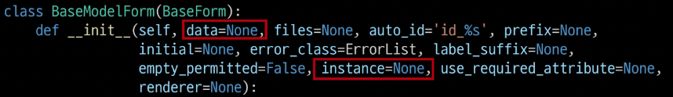

# Django Form

- 사용자의 요청 중 비정상적인 혹은 악의적인 요청이 있을 수 있다는 것을 항상 생각해야 함
- 사용자가 입력한 데이터가 우리가 원하는(개발자가 의도한) 데이터 형식이 맞는지에 대한 유효성 검증이 반드시 필요
- 이러한 유효성 검증은 많은 부가적인 것들을 고려해서 구현해야 하는데, 이는 개발 생산성을 늦출뿐더러 쉽지 않은 작업임
- Django Form은 이 과정에서 과중한 작업과 반복 코드를 줄여줌으로써 훨씬 쉽게 유효성 검증을 진행할 수 있도록 만들어 줌

### Form 에 대한 Django의 역할

- Form은 Django의 유효성 검사 도구 중 하나로 외부의 악의적 공격 및 데이터 손상에 대한 중요한 방어 수단
- Django는 Form과 관련한 유효성 검사를 단순화하고 자동화 할 수 있는 기능을 제공하여, 개발자가 직접 작성하는 코드보다 더 안전하고 빠르게 수행하는 코드를 작성할 수 있다.
    - 개발자가 필요한 핵심 부분만 집중할 수 있도록 돕는 프레임워크의 특성
- Django는 Form에 관련된 작업의 세 부분을 처리
    1. 렌더링을 위한 데이터 준비 및 재구성
    2. 데이터에 대한 HTML forms 생성
    3. 클라이언트로부터 받은 데이터 수신 및 처리

<br>

## Django Form Class

### Form Class 선언

- Form Class를 선언하는 것은 Model Class를 선언하는 것과 비슷하다. 비슷한 이름의 필드 타입을 많이 가지고 있다. (다만 이름만 같을 뿐 같은 필드는 아님)
- Model과 마찬가지로 상속을 통해 선언(forms 라이브러리의 Form 클래스를 상속받음)
- form에는 model field와 달리 TextField가 존재하지 않음
- Form Class를 forms.py에 작성하는 것은 규약이 아닌 컨벤션임. 파일 이름이 달라도 되고 models.py나 다른 어디에도 작성 가능. 다만 더 나은 유지보수의 관점 그리고 관행적으로 forms.py 파일 안에 작성하는 것을 권장
- 순서
    - 앱 폴더에 forms.py를 생성 후 Class 선언
    - view 함수 업데이트
    - template 업데이트
    - 업데이트 후 출력 확인
        - view 함수에서 정의한 Form Class의 인스턴스(form) 하나로 input 과 label 태그가 모두 렌더링되는 것을 확인하기
        - 각 태그의 속성 값들 또한 자동으로 설정되어 있음

### Form rendering options

- \<label> & \<input> 쌍에 대한 3가지 출력 옵션(폼 인스턴스의 메서드) `{{ form.as_p }}`
    - as_p()
        - 각 필드가 단락(<p> 태그)으로 감싸져서 렌더링
    - as_ul()
        - 각 필드가 목록 항목(<li> 태그)으로 감싸져서 렌더링
        - <ul> 태그는 직접 작성해야 한다
    - as_table()
        - 각 필드가 테이블(<tr> 태그) 행으로 감싸져서 렌더링

### Django의 2가지 HTML input 요소 표현

- Form fields
    - 입력에 대한 유효성 검사 로직을 처리
    - 템플릿에서 직접 사용됨
    - 예시. `forms.CharField()`
- Widgets
    - 웹 페이지의 HTML input 요소 렌더링을 담당(input 요소의 단순한 출력 부분을 담당)
    - Widgets는 반드시 form fields에 할당됨
    - 예시. `forms.CharField(widget=forms.Textarea)`

### Widgets

- Django의 HTML input element의 표현을 담당
- 단순히 HTML 렌더링을 처리한느 것이며 유효성 검증과 아무런 관계가 없음
- 즉 웹 페이지에서 input element의 단순 raw한 렌더링만을 처리하는 것일 뿐
- 다양한 built-in 위젯이 있으며 공식문서 참조

<br>

# Django ModelForm

## Django ModelForm Class

- Model을 통해 Form Class를 만들 수 있는 helper class
- ModelForm은 Form과 똑같은 방식으로 View함수에서만 사용

### ModelForm 선언

- forms 라이브러리에서 파생된 ModelForm 클래스를 상속받음
- 정의한 ModelForm 클래스 안에 Meta 클래스를 선언
- 어떤 모델을 기반으로 form을 작성할 것인지에 대한 정보를 Meta 클래스(Inner class)에 지정
    
    ```python
    from django import forms
    from .models import Article
    
    class ArticleForm(forms.ModelForm):
    
        class Meta:
            model = Article # 어떤 모델을 기반으로 할지
            fields = ('title', 'content',) # 기반으로 할 모델의 필드 중 어떤 것을 출력할지, 튜플이나 리스트로 작성함
    ```
    

### ModelForm에서의 Meta Class

- ModelForm의 정보를 작성하는 곳
- ModelForm을 사용할 경우 참조할 모델이 있어야 하는데, Meta class의 model 속성이 이를 구성함
    - 참조하는 모델에 정의된 field 정보를 Form에 적용함
    - fields 속성에 ‘\_\_all__’을 사용하여 모델의 모든 필드를 포함할 수 있음(`fields = '__all__'` )
    - 또는 exclude 속성을 사용하여 모델에서 포함하지 않을 필드를 지정할 수 있음
    - fileds와 exclude를 함께 작성해도 되나 권장하지 않음
- 참고, Meta data
    - 데이터를 표현하기 위한 데이터
    - 예시. 사진 파일에서
        - 사진 데이터
        - 사진 데이터의 데이터(촬영 시각, 렌즈, 조리개 값 등) == 사진의 Meta data
- 참고. 참조 값과 반환 값
    
    ```python
    def greeting():
        return 'hello'
    
    print(greeting) # <function greeting at 0x10761caf0>
    print(greeting()) # hello
    ```
    
    - 위 예시에서 함수를 호출하지 않고 이름만 작성면 함수의 참조 값을 출력하고, 함수를 호출하면 함수의 반환 값을 출력한다.
    - 함수를 호출하지 않고 함수 자체를 그대로 전달하여, 다른 함수에서 필요한 시점에 호출하고 싶을 때 참조 값을 사용함
    
    ```python
    urlpatterns = [
        path('', views.index, name="index"),
    ]
    ```
    
    - 위 코드에서 view 함수의 참조 값을 그대로 넘김으로써, path 함수가 내부적으로 해당 view 함수를 필요한 시점에 사용함
    - 클래스도 마찬가지로, Article이라는 클래스를 호출하지 않고(==model을 인스턴스로 만들지 않고) 작성하는 이유는 ArticleForm이 해당 클래스를 필요한 시점에 사용하기 위함
    - 더불어 이 경우에는 인스턴스가 필요한 것이 아닌, 실제 Article 모델의 참조 값을 통해 해당 클래스의 필드나 속성 등을 내부적으로 참조하기 위한 이유도 있음
    
    ```python
    class ArticleForm(forms.ModelForm):
        class Meta:
            model = Article
            fields = '__all__'
    ```
    

- Meta 클래스의 작성 위치(클래스 안의 클래스)
    - 파이썬에서는 Inner class 혹은 Nested class라고 하는데 이 시점에 중요하지 않음. 파이썬의 문법적 개념으로 접근하지 말 것
    - 단순히 모델 정보를 Meta라는 이름의 내부 클래스로 작성하도록 ModelForm의 설계가 이렇게 되어있을 뿐

<br>

## ModelForm with view functions

### is_valid() method

- 유효성 검사를 실행하고, 데이터가 유효한지 여부를 boolean으로 반환
- 데이터 유효성 검사를 보장하기 위한 많은 테스트에 대해 Django는 is_valid()를 제공하여 개발자의 편의를 도움

### form 인스턴스의 errors 속성

- is_valid()의 반환 값이 False인 경우 form 인스턴스의 errors 속성에 값이 작성되는데, 유효성 검증을 실패한 원인이 딕셔너리 형태로 저장됨
- 이같은 특징을 통해 다음과 같은 구조로 코드를 작성하면 유효성 검증을 실패했을 때 사용자에게 실패 결과 메시지를 출력해줄 수 있음

```python
def create(request):
    form = ArticleForm(request.POST)
    if form.is_valid():
        article = form.save()
        return redirect('articles:detail', article.pk)
    context = {
        'form': form,
    }
    return render(request, 'articles/new.html', context) # 에러메시를 이용하기 위해 redirect가 아닌 render해줘야 함
```

### save() method

- form 인스턴스에 바인딩 된 데이터를 통해 데이터베이스 객체를 만들고 저장
- ModelForm의 하위 클래스는 키워드 인자 instance 여부를 통해 생성할지, 수정할지를 결정함
    - instance 키워드 인자가 없으면 생성, 없으면 수정 즉 아래와 같다.
    - 제공되지 않은 경우 save()는 지정된 모델의 새 인스턴스를 만듦(CREATE)
    - 제공되면 save()는 해당 인스턴스를 수정(UPDATE)
    
    ```python
    # CREATE
    form = ArticleForm(request.POST)
    form.save()
    
    # UPDATE
    form = ArticleForm(request.POST, instance=article)
    form.save()
    ```
    
- UPDATE
    - ModelForm의 인자 instance는 수정 대상이 되는 객체(기존 객체)를 지정
    - request.POST - 사용자가 form을 통해 전송한 데이터(새로운 데이터)
    - instance - 수정이 되는 대상
- 참고. ModelForm 키워드 인자 data와 instance Django github에서 살펴보기
    - 코드 작성할 때 arguments 순서 때문에 data 키워드는 생략 가능하지만(첫번째) instance 키워드는 생략하면 안 된다.
    
    
    
<br>

## Form 과 ModelForm

- ModelForm이 Form보다 더 좋은 것이 아니라 각자 역할이 다른 것
- **Form**
    - 사용자로부터 받는 데이터가 DB와 연관되어 있지 않은 경우에 사용
    - DB에 영향을 미치지 않고 단순 데이터만 사용하는 경우
    - 예시. 로그인 - 사용자의 데이터를 받아 인증 과정에서만 사용 후 별도로 DB에 저장하지 않음
- **ModelForm**
    - 사용자로부터 받는 데이터가 DB와 연관되어 있는 경우에 사용
    - 데이터의 유효성 검사가 끝나면 데이터를 각각 어떤 레코드에 맵핑해야 할 지 이미 알고 있기 때문에 곧바로 save() 호출이 가능

- 정리: Django Form/ModelForm Class

  - Django 프로젝트의 주요 유효성 검사 도구
  - 공격 및 데이터 손상에 대한 중요한 방어 수단
  - 유효성 검사에 대해 개발자에게 강력한 편의를 제공

<br>

## Widgets 활용하기

### 위젯을 작성하는 2가지 방법

```python
class ArticleForm(forms.ModelForm):
    class Meta:
        modle = Article
        fields = '__all__'
        widgets = {
            'title': forms.TextInput(attrs={
                'class': 'title',
                'placeholder': 'Enter the title',
                'maxlength': 10,
            }
        }
```

```python
class ArticleForm(forms.ModelForm):
    title = forms.CharField(
        label='제목'
        widget=forms.TextInput(
            attrs={
                'class': 'my-title',
                'placeholder': 'Enter the title',
            }
        }
    }
    class Meta:
        model = Taticle
        fields = '__all__'
```

두 번째 작성 방식을 권장(meta에 들어갈 내용이 아니기 때문에 밖으로 빼 주는 게 좋음)

<br>

# Handling HTTP requests (실습)

### 개요

- HTTP requests 처리에 따른 view 함수 구조 변화
- new-create, edit-update의 view 함수 역할을 잘 살펴보면 하나의 공통점과 하나의 차이점이 있음
- 공통점
    - new-create는 모두 CREATE 로직을 구현하기 위한 공통 목적
    - edit-update는 모두 UPDATE 로직을 구현하기 위한 공통 목적
- 차이점
    - new와 edit은 GET 요청에 대한 처리만을, create와 update는 POST 요청에 대한 처리만을 진행
- 이 공통점과 차이점을 기반으로, 하나의 view 함수에서 method에 따라 로직이 분리되도록 변경

### CREATE

- new와 create의 view 함수를 합침
    - 각각의 역할은 request.method 값을 기준으로 나뉨
    - context의 들여쓰기 위치
        - `if form.is_valid():` 에서 False로 평가 받았을 때 에러 정보가 담긴 form 인스턴스가 context로 넘어올 수 있도록 인덴테이션 위치 조정
- 불필요해진 new의 view 함수와 url path를 삭제
- new.html → create.html 이름 변경 및 action 속성 값 수정
- new.html → create.html 이름 변경으로 인한 템플릿 경로 수정
- index페이지 등에 있던 new 관련 링크 수정

### UPDATE

- edit과 update의 view 함수를 합침
- 불필요해진 edit의 view 함수와 url path를 삭제
- edit.html → update.html 이름 변경 및 관련 정보 수정
- edit.html → update.html 이름 변경으로 인한 관련 정보 수정
- view 함수를 POST 요청에 대해서만 삭제가 가능하도록 수정

<br>

# View decorators

- view decorators를 사용해 view 함수를 단단하게 만들 수 있다.

### 데코레이터(Decorator)

- 기존에 작성된 함수에 기능을 추가하고 싶을 때, 해당 함수를 수정하지 않고 기능을 추가해주는 함수
- Django는 다양한 HTTP 기능을 지원하기 위해 view 함수에 적용할 수 있는 여러 데코레이터를 제공

### Allowed HTTP methods

- django.views.decorators.http의 데코레이터를 사용하여 요청 메서드를 기반으로 접근을 제한할 수 있음
- 일치하지 않는 메서드 요청이라면 405 Method Not Allowed를 반환
    - 참고. 405 Method Now Allowed - 요청 방법이 서버에게 전달되었으나 사용 불가능한 상태
- 메서드 목록
    - require_http_methods()
    - require_POST()
    - require_safe()
- require_http_methods()
    - view 함수가 특정한 요청 method만 허용하도록 하는 데코레이터
- require_POST()
    - viewa 함수가 POST 요청 method만 허용하도록 하는 데코레이터
    - url로 delete 시도 후 서버 로그에서 405 http status code 확인해보기
- require_safe()
    - require_GET이 있지만 Django에서는 require_safe를 사용하는 것을 권장
