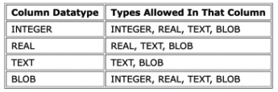
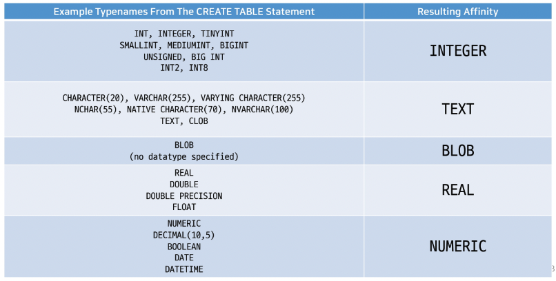
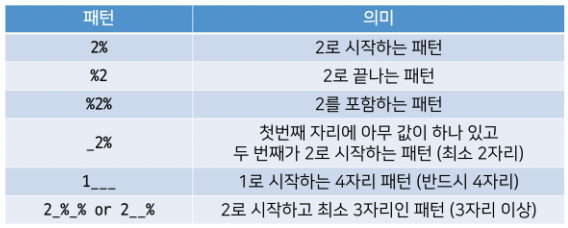

# Database(DB)

- Database 정의
    - 체계화된 데이터의 모임
    - 여러 사람이 공유하고 사용할 목적으로 통합 관리되는 정보의 집합
    - 검색, 구조화 같은 작업을 보다 쉽게 하기 위해 조직화된 데이터를 수집하는 저장 시스템
        - 내용을 고도로 구조화 함으로써 검색과 갱신의 효율화를 꾀한 것
        - 즉 자료 파일을 조직적으로 통합하여 자료 항목의 중복을 없애고 구조화하여 기억시켜 놓은 자료의 집합체
    - 이러한 Database를 조작하는 프로그램 = DBMS(Database Management System)
        - 한 번쯤 들어봤을 Oracle, MysQL, SQLite 등등이 모두 DBMS
        - DBMS에서 Database를 조작하기 위해 사용하는 언어를 SQL이라 함
    - 웹 개발에서 대부분의 데이터베이스는 관계형 데이터베이스 관리 시스템(RDBMS)을 사용하여 SQL로 데이터와 프로그래밍을 구성

<br>

## RDB(Relational Database)

- Relatinoal Database (관계형 데이터베이스)
- 자료를 여러 테이블로 나누어서 관리하고, 이 테이블간 관계를 설정해 여러 데이터를 쉽게 조작할 수 있다는 장점이 있음
- SQL을 사용하여 데이터를 조회하고 조작
- RDB 기본 구조
    - 스키마(Schema)
        - 테이블의 구조(Structure)
        - 데이터베이스에서 자료의 구조, 표현 방법, 관계 등 전반적인 명세를 기술한 것
    - 테이블(Table)
        - 필드와 레코드를 사용해 조직된 데이터 요소들의 집합
        - 관계(Relation)라고도 부름
- RDB 에는 테이블이 여러 개 존재한다 ← RDB의 특징
- RDBMS
    - Relational Database Management System(관계형 데이터베이스 관리 시스템)
    - 관계형 데이터베이스를 만들고 업데이트하고 관리하는 데 사용하는 프로그램
    - 예. SQLite, MySQL, PostgreSQL, Microsoft SQL Server, Oracle Database 등
- SQLite
    - 응용 프로그램에 파일 형식으로 넣어 사용하는 비교적 가벼운 데이터베이스
    - 안드로이드, iOS, macOS에 기본적으로 탑재되어 있으며 임베디드 소프트웨어에서도 많이 활용됨
    - 오픈 소스 프로젝트이기 때문에 자유롭게 사용 가능
    - 대규모 동시 처리 작업에는 적합하지 않음
    - 다른 RDBMS에서 지원하는 SQL 기능을 지원하지 않을 수 있음
    - Django Framework의 기본 데이터베이스

<br>

## SQL

### SQL이란?

- Structured Query Language
- RDBMS의 데이터를 관리하기 위해 설계된 특수 목적의 프로그래밍 언어
- RDBMS에서 데이터베이스 스키마를 생성 및 수정할 수 있으며, 테이블에서의 자료 검색 및 관리도 할 수 있음
- 데이터베이스 객체에 대한 처리를 관리하거나 접근 권한을 설정하여 허가된 사용자만 RDBMS를 관리할 수 있도록 할 수 있음
- 많은 데이터베이스 관련 프로그램들이 SQL을 표준으로 채택하고 있음

### SQL commands

특성에 따라 다음 세 가지 그룹으로 분류

1. DDL (Data Definition Language)
    - 데이터 정의 언어
    - 관계형 데이터베이스 구조(테이블, 스키마)를 정의(생성, 수정 및 삭제)하기 위한 명령어
    - CREATE, DROP, ALTER
2. DML (Data Manipulation Language)
    - 데이터 조작 언어
    - 데이터를 조작(추가, 조회, 변경, 삭제)하기 위한 명령어
    - INSERT, SELECT, UPDATE, DELETE
3. DCL (Data Control Language)
    - 데이터 제어 언어
    - 데이터의 보안, 수행제어, 사용자 권한 부여 등을 정의하기 위한 명령어
    - GRANT, REVOKE, COMMIT, ROLLBACK
- SQLite는 파일로 관리되는 DB이기 때문에 SQL을 이용한 접근 제한이 아닌 운영체제의 파일 접근 권한으로만 제어 가능. 그래서 SQLite에는 권한 설정을 담당하는 GRANT(권한부여)와 REVOKE(권한회수)는 지원하지 않음. - DCL 부분은 생략

### SQL Syntax

- 모든 SQL문(statement)는 SELECT, INSERT, UPDATE 등과 같은 키워드로 시작하고, 하나의 statement는 세미콜론(;)으로 끝남
    - 세미콜론은 각 SQL문을 구분하는 표준 방법
- SQL 키워드는 대소문자를 구분하지 않음
    - 즉 SELECT와 select는 SQL문에서 동일한 의미
    - 하지만 구조 파악을 쉽게 하기 위해 대문자로 작성하는 것을 권장
- 참고. Statement & Cluase
    - Statement(문)
        - 독립적으로 실행할 수 있는 완전한 코드 조각
        - statement는 clause로 구성됨
    - Clause(절)
        - statement의 하위 단위
    - 예. `SELECT column_name FROM table_name;`
        - SELECT statement라 부름
        - 이 statement는 다음과 같이 2개의 clause로 구성됨
            - SELECT column_name
            - FROM table_name

<br>

## DDL

- SQL 데이터 정의 언어를 사용하여 테이블 데이터베이스 개체를 만드는 방법
- DDL은 테이블 구조를 관리
    - CREATE, ALTER, DROP

### SQLite Data Types

- SQLite Data Types
    1. NULL
        - NULL value
        - 정보가 없거나 알 수 없음을 의미 (missing information or unknown)
    2. INTEGER
        - 정수
        - 크기에 따라 0, 1, 2, 3, 4, 6 또는 8 바이트와 같은 가변 크기를 가짐
    3. REAL
        - 실수
        - 8바이트 부동 소수점을 사용하는 10진수의 값이 있는 실수
    4. TEXT
        - 문자 데이터
    5. BLOB (Binary Large Object)
        - 입력된 그대로 저장된 데이터 덩어리 (대용 타입 없음)
        - 바이너리 등 멀티미디어 파일
        - 예시: 이미지 데이터
    - 참고.
        - SQLite에는 별도의 Boolean 타입이 없음. 대신 Boolean 값은 정수 0(false)과 1(true)로 저장됨
        - SQLite에는 날짜 및 시간을 저장하기 위한 타입이 없음. 대신 SQLite의 built-in “Date And Time Functions”으로 TEXT, REAL 또는 INTEGER 값으로 저장할 수 있음
        - Binary Data
            - 데이터의 저장과 처리를 목적으로 0과 1의 이진 형식으로 인코딩 된 파일
            - 기본적으로 컴퓨터의 모든 데이터는 binary data이다. 다만, 이를 필요에 따라서 텍스트 타입으로 변형해서 사용하는 것
- 데이터 타입 결정 규칙
    - 값에 둘러싸는 따옴표와 소수점 또는 지수가 없으면 - INTEGER
    - 값이 작은 따옴표나 큰따옴표로 묶이면 - TEXT
    - 값에 따옴표 없이 소수점, 지수가 있으면 - REAL
    - 값이 따옴표 없이 NULL 이면 - NULL
- SQLite Datatypes 특징
    - SQLite는 다른 모든 SQL 데이터베이스 엔진(MySQL, PostgreSQL 등)의 정적이고 엄격한 타입(static, rigid typing)이 아닌 ‘동적 타입 시스템(dynamic type system)’을 사용. → 컬럼에 선언된 데이터 타입에 의해서가 아니라 컬럼에 저장된 값에 따라 데이터 타입이 결정됨
    - SQLite는 테이블을 생성할 때 컬럼에 대해 특정 데이터 타입을 선언하지 않아도 됨.
        - 이렇게 생성한 테이블의 동일한 컬럼에 정수 1을 넣을 경우 INTEGER로 타입이 지정되고, 문자 ‘1’을 넣을 경우 TEXT 타입으로 지정됨
        - 다만 이는 다른 데이터베이스와의 호환성 문제가 있기 때문에 테이블 생성시 데이터 타입을 지정하는 것을 권장
    - SQLite는 데이터 타입을 지정하면 입력된 데이터의 타입을 지정된 데이터 타입으로 변환해줌.
        - 허용 가능한 타입 변환은 다음과 같음
            
            
            
    - Type Affinity (타입 선호도)
        - 특정 컬럼에 저장된 데이터에 권장되는 타입
        - 데이터 타입 작성시 SQLite의 5가지 데이터 타입이 아닌 다른 데이터 타입을 선언한다면, 내부적으로 각 타입의 지정된 선호도에 따라 인식됨
            
            
            
        - 다른 데이터베이스 엔진 간의 호환성을 최대화
        - 정적이고 엄격한 타입을 사용하는 데이터베이스의 SQL문을 SQLite에서도 작동하도록 하기 위함

### Constraints

- Constraints(제약조건)
    - 입력하는 자료에 대해 제약을 정함
    - 제약에 맞지 않다면 입력이 거부됨
    - 사용자가 원하는 조건의 데이터만 유지하기 위한, 즉 데이터의 무결성을 유지하기 위한 보편적인 방법으로 테이블의 특정 컬럼에 설정하는 제약
- 데이터 무결성
    - 데이터베이스 내의 데이터에 대한 정확성, 일관성을 보장하기 위해 데이터 변경 혹은 수정시 여러 제한을 두어 데이터의 정확성을 보증하는 것
    - 무결성이란 데이터의 정확성, 일관성을 나타냄
    - 데이터베이스에 저장된 데이터의 무결정을 보장하고 데이터베이스의 상태를 일관되게 유지하는 것이 목적
- Constraints 종류
    - NOT NULL
        - 컬럼이 NULL 값을 허용하지 않도록 지정
        - 기본적으로 테이블의 모든 컬럼은 NOT NULL 제약 조건을 명시적으로 사용하는 경우를 제외하고는 NULL 값을 허용함
    - UNIQUE
        - 컬럼의 모든 값이 서로 구별되거나 고유한 값이 되도록 함
    - PRIMARY KEY
        - 테이블에서 행의 고유성을 식별하는 데 사용되는 컬럼
        - 각 테이블에는 하나의 기본 키만 있음
        - 암시적으로 NOT NULL 제약 조건이 포함되어 있음
        - 주의. INTEGER 타입에만 사용 가능(INT, BIGINT 등은 불가)
    - AUTOINCREMENT
        - 사용되지 않은 값이나 이전에 삭제된 행의 값을 재사용하는 것을 방지 (그래서 PRIMARY KEY와 같이 사용한다)
        - INTEGER PRIMARY KEY 다음에 작성하면 해당 rowid를 다시 재사용하지 못하도록 함
        
        ```sql
        CREATE TABLE table_name (
          id INTEGER PRIMARY KEY AUTOINCREMENT,
          ...
        );
        ```
        
        - Django에서 테이블 생성시 id 컬럼에 기본적으로 사용하는 제약 조건
- rowid의 특징
    - 테이블을 생성할 때마다 rowid라는 AUTOINCREMENT 컬럼이 자동으로 생성됨
    - 테이블의 행을 고유하게 식별하는 64비트 부호 있는 정수 값
    - 
    - 참고. 이론상으로 한 개의 테이블에 들어가는 최대 레코드의 개수(행 수) == 2^64개

### CREATE TABLE statement

- ‘Create a new table in the database’
- 데이터베이스에 새 테이블을 만듦
    - 스키마를 만든다.
    - 레코드를 작성하는 부분은 없다 (해당 부분은 DML에서 함)
    
    ```sql
    CREATE TABLE table_name (
      column_1 data_type constraints,
      column_2 data_type constraints,
      column_3 data_type constraints,
    );
    ```
    
- 예시
    
    ```sql
    CREATE TABLE contacts (
      name TEXT NOT NULL,
    	age INTEGER NOT NULL,
      email TEXT NOT NULL UNIQUE
    );
    ```
    
- contacts 테이블 생성
- Query 실행하기
    - 실행하고자 하는 명령문에 커서를 두고 마우스 우측 버튼 → ‘Run Selected Query’ 선택
    - 명령문을 모두 선택할 필요는 없으며, 실행하고자 하는 명령문 안에 커서가 올라가 있으면 가능
    - 참고. ‘Run Query’ 실행시 스크립트의 모든 명령문이 실행됨
- id 컬럼은 우리가 직접 기본 키 역할의 컬럼을 정의하지 않으면 자동으로 rowid라는 컬럼으로 만들어짐
- 참고, SQL문을 작성할 대 트레일링 콤마는 붙이지 말 것. (문법 에러)

### ALTER TABLE

- 기존 테이블의 구조를 수정(변경)
- SQLite의 ALTER TABLE 문을 사용하면 기존 테이블에서 다음과 같은 변경작업을 수행할 수 있음
    - Rename a table
    - Rename a column
    - Add a new column to a table
    - Delete a column
- 예시

```sql
-- 1. Raname a table
ALTER TABLE table_name RENAME TO new_table_name;

-- 2. Rename a column
ALTER TABLE table_name RENAME COLUMN column_name TO new_column_name;

-- 3. Add a new column to a table
ALTER TABLE table_name ADD COLUMN column_definition;

-- 4. Delete a column
ALTER TABLE table_name DROP COLUMN column_name;
```

- ALTER TABLE ADD COLUMN
    - 만약 테이블에 기존 데이터가 있을 경우 다음과 같은 에러가 발생.
        - Cannot add NOT NULL column with default value NULL
    - 이전에 이미 저장된 데이터들은 새롭게 추가되는 컬럼에 값이 없기 때문에 NULL이 작성되는데 제약조건 NOT NULL에 걸리는 것.
    - 다음과 같이 DEFAULT 제약 조건을 사용하여 해결할 수 있음
    - `ALTER TABLE new_table_name ADD COLUMN new_column_name TEXT NOT NULL DEFAULT 'no value';`
- ALTER TABLE DROP COLUMN
    - 컬럼 삭제
    - 단, 삭제하지 못하는 경우가 있음
        - 컬럼이 다른 부분에서 참조되는 경우
            - FOREIGN KEY 제약 조건에서 사용되는 경우
            - PRIMARY KEY인 경우
            - UNIQUE 제약 조건이 있는 경우

### DROP TABLE

- ‘Remove a table from the database’
- 데이터베이스에서 테이블을 제거
    
    ```sql
    DROP TABLE table_name;
    ```
    
- 존재하지 않는 테이블을 제거하면 SQLite에서 오류가 발생
- 한 번에 하나의 테이블만 삭제할 수 있음 - 여러 테이블을 제거하려면 여러 DROP TABLE 문을 실행해야 함
- DROP TABLE 문은 실행 취소하거나 복구할 수 없음

<br>

## DML

- DML을 통해 데이터를 조작하기(CRUD)
- INSERT, SELECT, UPDATE, DELETE

### Simple query

- SELECT statement(조회)
    - ‘Query data from a table’
    - 특정 테이블에서 데이터를 조회하기 위해 사용
    - 문법 규칙
        
        ```sql
        SELECT column1, column2 FROM table_name;
        ```
        
        - SELECT 절에서 컬럼 또는 쉼표로 구분된 컬럼 목록을 지정
        - FROM 절에서 데이터를 가져올 테이블을 지정
    - SELECT 문은 다양한 절과 함께 사용할 수 있다.
        - ORDER BY
        - DISTINCT
        - WHERE
        - LIMIT
        - LIKE
        - GROUP BY
    - 전체 데이터 조회시 모든 컬럼에 대한 shorthand(약칭)인 *(asterisk)를 사용할 수 있음
    - rowid 컬럼은 명시하여 조회할 수 있다.
        - `SELECT rowid FROM users;`

### Sorting rows(정렬)

- ORDER BY clause
    - ‘Sort a result set of a query’
    - SELECT 문에 추가하여 결과를 정렬
        
        ```sql
        SELECT select_list FROM table_name
        ORDER BY column_1 ASC, column_2 DESC;
        ```
        
    - ORDER BY 절은 FROM 절 뒤에 위치함
    - 하나 이상의 컬럼을 기준으로 결과를 오름차순, 내림차순으로 정렬할 수 있음. 이를 위해 ORDER BY 절 다음에 ASC 또는 DESC 키워드를 사용
        - ASC: 오름차순(기본값)
        - DESC: 내림차순
    - 둘 이상의 컬럼을 이용해 정렬할 경우 첫 번째 열을 사용하여 레코드를 정렬하고, 그다음 두 번째 열을 사용하여 레코드를 정렬한다.
    - 참고. Sorting NULLs
        - 정렬과 관련하여 SQLite는 NULL을 다른 값보다 작은 것으로 간주. 즉 ASC를 사용하는 경우 결과의 시작 부분에 NULL이 표시되고, DESC를 사용하는 경우 결과의 끝에 NULL이 표시됨

### Filtering data

- SELECT DISTINCT clause
    - ‘Remove duplicate rows in the result’
    - 조회 결과에서 중복된 행을 제거
    - 문법 규칙
        
        ```sql
        SELECT DISTINCT select_list FROM table_name;
        ```
        
        - DISTINCT 절은 SELECT 키워드 바로 뒤에 나타나야 함
        - DISTINCT 키워드 뒤에 컬럼 또는 컬럼 목록을 작성
    - 참고. NULL with DISTINCT
        - SQLite는 NULL값을 중복으로 간주
        - NULL 값이 있는 컬럼에 DISTINCT 절을 사용하면 SQLite는 NULL 값의 한 행을 유지
- WHERE clause
    - ‘Specify the search condition for rows returned by the query’
    - 조회 시 특정 검색 조건을 지정
    - WHERE 절은 SELECT 문에서 선택적으로 사용할 수 있는 절
        - SELECT문 외에도 UPDATE 및 DELETE 문에서 WHERE 절을 사용할 수 있음
    - FROM 절 뒤에 작성
        
        ```sql
        SELECT column_list FROM table_name 
        WHERE search_condition;
        ```
        
    - WHERE의 검색 조건 작성 형식
        - left_expression COMPARISON_OPERATOR right_expression
- SQLite comparison operators (비교 연산자)
    - =, <> or !=, <, >, <=, >=
- SQLite logical operators (논리 연산자)
    - 일부 표현식의 truth를 테스트
    - 1, 0 또는 NULL 값을 반환
    - ALL, AND, ANY, BETWEEN, IN, LIKE, NOT, OR 등
- LIKE operator
    - ‘Query data based on pattern matching’
    - 패턴 일치를 기반으로 데이터를 조회
    - SELECT, DELETE, UPDATE문의 WHERE 절에서 사용
    - 기본적으로 대소문자를 구분하지 않음
        - `'A' LIKE 'a'` 는 true
    - SQLite는 패턴 구성을 위한 두 개의 와일드카드(wildcards)를 제공
        - % : 0개 이상의 문자가 올 수 있음을 의미
        - _ : 단일(1개) 문자가 있음을 의미
        
        
        
    - 참고. “wildcards” caracter
        - 파일을 지정할 때, 구체적인 이름 대신에 여러 파일을 동시에 지정할 목적으로 사용하는 특수 기호
        - *, ? 등
        - 주로 특정한 패턴이 있는 문자열 혹은 파일을 찾거나, 긴 이름을 생략할 때 쓰임
        - 텍스트 값에서 알 수 없는 문자를 대신해 사용할 수 있는 특수문자로, 유사하지만 동일한 데이터가 아닌 여러 항목을 찾거나 지정된 패턴 일치를 기반으로 데이터를 수집하는 데 도움이 될 수 있음
- IN operator
    - ‘Determine whether a value matches any value in a list of values’
    - 값이 값 목록 결과에 있는 값과 일치하는지 확인
    - 표현식이 값 목록의 값과 일치하는지 여부에 따라 true 또는 false를 반환
    - IN 연산자의 결과를 부정하려면 NOT IN 연산자를 사용
- BETWEEN operator
    - ‘Test whether a value is in a range of values”
    - 값이 값 범위에 있는지 테스트
        
        ```sql
        test_expression BETWEEN low_expression AND high_expression
        ```
        
    - 값이 지정된 범위에 있으면 true를 반환
    - SELECT, DELETE 및 UPDATE 문의 WHERE 절에서 사용할 수 있음
    - BETWEEN 연산자의 결과를 부정하려면 NOT BETWEEN 연산자를 사용
- LIMIT clause
    - ‘Constrain the number of rows returned by a query’
    - 쿼리에서 반환되는 행 수를 제한
        
        ```sql
        SELECT column_list FROM table_name LIMIT row_count;
        ```
        
    - SELECT문에서 선택적으로 사용할 수 있는 절
    - row_count는 반환되는 행 수를 지정하는 양의 정수를 의미
- OFFSET keyword
    - LIMIT 절을 사용하면 첫 번째 데이터부터 지정한 수 만큼의 데이터를 받아올 수 있지만, OFFSET과 함께 사용하면 특정 지정된 위치에서부터 데이터를 조회할 수 있음

### Grouping data

- GROUP BY clause
    
    ```sql
    SELECT column_1, aggregate_function(column_2) 
    FROM table_name 
    GROUP BY column_1, column_2;
    ```
    
    - ‘Make a set of summary rows from a set of rows’
    - 특정 그룹으로 묶인 결과를 생성
    - 선택된 컬럼 값을 기준으로 데이터(행)들의 공통 값을 묶어서 결과로 나타냄
    - SELECT 문에서 선택적으로 사용가능한 절
    - SELECT 문의 FROM 절 뒤에 작성
        - WHERE 절이 포함된 경우 WHERE 절 뒤에 작성해야 함
    - 각 그룹에 대해 MIN, MAX, SUM, COUNT 또는 AVG와 같은 집계 함수(aggregate function)를 적용하여 각 그룹에 대한 추가적인 정보를 제공할 수 있음
- Aggregate function
    - 집계 함수
    - 값 집합의 최대값, 최소값, 평균, 합계 및 개수를 계산하여 단일 값을 반환. (여러 행으로부터 하나의 결과 값을 반환하는 함수)
    - SELECT 문의 GROUP BY 절과 함께 종종 사용됨
    - 제공하는 함수 목록
        - AVG(), COUNT(), MAX(), MIN(), SUM()
    - AVG(), MAX(), MIN(), SUM()은 숫자를 기준으로 계산이 되어야 하기 때문에 컬럼의 데이터타입이 숫자(INTEGER)일 때만 사용 가능

### Changing data

- INSERT statement
    - ‘Insert new rows into a table’
    - 새 행을 테이블에 삽입
    - 문법 규칙
        
        ```sql
        INSERT INTO table_name (column1, column2, ...)
        VALUES (value1, value2, ...);
        ```
        
        - 먼저 INSERT INTO 키워드 뒤에 데이터를 삽입할 테이블의 이름을 지정
        - 테이블 이름 뒤에 쉼표로 구분된 컬럼 목록을 추가
            - 컬럼 목록은 선택 사항이지만 컬럼 목록을 포함하는 것이 권장됨
        - VALUES 키워드 뒤에 쉼표로 구분된 값 목록을 추가
            - 만약 컬럼 목록을 생략한 경우 값 목록은 모든 컬럼에 대한 값을 지정해야 함
            - 값 목록의 개수는 컬럼 목록의 개수와 같아야 함
- UPDATE statement
    - ‘Update existing rows in a table’
    - 테이블에 있는 기존 행의 데이터를 업데이트한다.
    - 문법 규칙
        
        ```sql
        UPDATE table_name
        SET column_1 = new_value_1, column_2 = new_value_2
        WHERE search_condition;
        ```
        
        - UPDATE 절 이후에 업데이트할 테이블을 지정
        - SET 절에서 테이블의 각 컬럼에 대해 새 값을 설정
        - WHERE 절의 조건을 사용하여 업데이트할 행을 지정
            - WHERE 절은 선택 사항이며, 생략하면 UPDATE 문은 테이블의 모든 행에 있는 데이터를 업데이트함
        - 선택적으로 ORDER BY 및 LIMIT 절을 사용하여 업데이트할 행 수를 지정할 수도 있음
- DELETE statement
    - ‘Delete rows from a table’
    - 테이블에서 행을 제거
    - 테이블의 한 행, 여러 행 및 모든 행을 삭제할 수 있음
    - 문법 규칙
        
        ```sql
        DELETE FROM table_name
        WHERE search_condition;
        ```
        
        - DELETE FROM 키워드 뒤에 행을 제거하려는 테이블의 이름을 지정
        - WHERE 절에 검색 조건을 추가하여 제거할 행을 식별
            - WHERE 절은 선택 사항이며, 생략하면 DELETE 문은 테이블의 모든 행을 삭제
        - 선택적으로 ORDER BY 및 LIMIT 절을 사용하여 삭제할 행 수를 지정할 수도 있음

## 데이터 구조화의 중요성

- 다루고자 하는 데이터를 구조화해서 저장하면 데이터의 가공 및 확장이 용이
- 모든 서비스는 데이터를 효율적으로 다루는 것이 필수적
- 예를 들어 빅데이터, 인공지능과 같은 대규모 데이터로부터 의미 있는 분석 결과를 뽑아낼 수 있음
- 데이터에 대한 액세스 및 처리량을 최적화하는 것이 점점 중요해지고 있으며 앞으로 데이터베이스는 점점 자동화되어 클라우드 기술, 머신러닝 등을 사용해 더욱더 고도화된 데이터를 다루고 처리하게 될 것