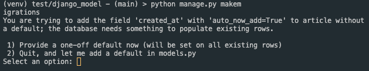
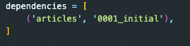
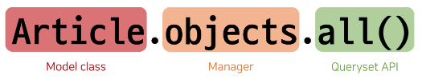
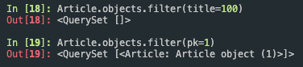
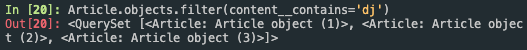

# Database

- 체계화된 데이터의 모임
- 검색 및 구조화 같은 작업을 보다 쉽게 하기 위해 조직화된 데이터를 수집하는 저장 시스템

### Database 기본 구조

1. 스키마(Schema)
   - 뼈대(Structure)
   - 데이터베이스에서 자료의 구조, 표현 방법, 관계 등을 정의한 구조
   - 데이터베이스가 어떻게 생겼는지에 대한 요약본이라고 생각하면 된다
2. 테이블(Table)
   - 필드와 레코드를 사용해 조직된 데이터 요소들의 집합
   - 관계(Relation)라고도 부름
   - 필드(field)
     - 속성, 컬럼(Column)
     - 각 필드에는 고유한 데이터 형식이 지정됨 (INT, TEXT 등)
   - 레코드(record)
     - 튜플, 행(Row)
     - 테이블의 데이터는 레코드에 저장됨

### PK (Primary Key)

- 기본 키
- 각 레코드의 고유한 값(식별자로 사용)
- 기술적으로 다른 항목과 절대로 중복되어 나타날 수 없는 단일 값(unique)을 가짐
- 데이터베이스 관리 및 테이블 간 관계 설정시 주요하게 활용됨
- 예를 들어 주민등록번호 - 어떤 사람을 나타내는 고유한 값으로써 사용할 수 있다

### 쿼리(Query)

- 데이터를 조회하기 위한 명령어를 일컫는다
- 조건에 맞는 데이터를 추출하거나 조작하는 명령어(주로 테이블형 자료구조에서)
- “Query를 날린다" == “데이터베이스를 조작한다”

<br>

## Django Model

- Django는 웹 애플리케이션의 데이터를 구조화하고 조작하기 위한 추상적인 계층(모델)을 제공
  - 데이터베이스를 구조화하고 조작할 수 있도록 도와주는 도구
- Django는 Model을 통해 데이터에 접속하고 관리
- 단일한 데이터에 대한 정보를 가짐
- 사용자가 저장하는 데이터들의 필수적인 필드들과 동작들을 포함
- 저장된 데이터베이스의 구조(layout)
- 일반적으로 각각의 모델은 하나의 데이터베이스 테이블에 매핑
  - 모델 클래스 1개 == 데이터베이스 테이블 1개

### Django Model 실습

- models.py 작성
  - 모델 클래스를 작성하는 것은 데이터베이스 테이블의 스키마를 정의하는 것
  - 모델 클래스 == 테이블 스키마
  - import된 models 모듈 안의 Model 클래스를 상속하는 클래스를 정의한다. 즉 각 모델은 django.models.Model 클래스의 서브 클래스로 표현됨
  - 클래스 변수가 하나의 DB 필드가 된다
    - 클래스 변수(속성)명: DB 필드의 이름
  - 필드의 데이터타입을 필수로 지정해주어야 함
    - 클래스 변수 값 (models 모듈의 Field 클래스): DB 필드의 데이터 타입
  - id 컬럼은 테이블 생성시 Django가 자동으로 생성

### Django Model Field

- Django는 모델 필드를 통해 테이블의 필드(컬럼)에 저장할 데이터 유형(INT, TEXT 등)을 정의
- 데이터 유형에 따라 다양한 모델 필드를 제공(공식 문서 참고)
- CharField(max_length=None, \*\*options)
  - 길이의 제한이 있는 문자열을 넣을 때 사용
  - max_length
    - 필드의 최대 길이(문자)
      - 최대 255자까지
    - CharField의 필수 인자
    - 데이터베이스와 Django의 유효성 검사(값을 검증하는 것)에서 활용됨
- TextField(\*\*options)
  - 글자의 수가 많을 때 사용
    - django에 어떤 db를 붙이느냐에 따라 최대 글자수가 달라진다
    - SQLite의 경우 2\*\*31 -1 개까지 지원함
  - max_length 옵션 작성시 사용자 입력 단계에서는 반영되지만, 모델과 데이터베이스 단계에는 적용되지 않음. 즉 실제로 저장될 때 길이에 대한 유효성을 검증하지 않음
- models.py는 데이터베이스 스키마를 설계한 것
- 이제 데이터베이스에 테이블을 생성하기 위한 설계도 작성이 필요함

### Migrations

- 모델에 대한 청사진(blueprint)을 만들고 이를 통해 테이블을 생성하는 일련의 과정
- Django가 모델에 생긴 변화(필드 추가, 모델 삭제 등)를 DB에 반영하는 방법
- Migrations 관련 **주요**(!!) 명령어
  1. makemigrations
  2. migrate
- makemigrations
  - 모델을 작성 혹은 병경한 것에 기반한 새로운 migration을 만들 때 사용
  - 테이블을 만들기 위한 설계도를 생성하는 것
  - `python manage.py makemigrations`
- migrate
  - makemigrations로 만든 설계도를 실제 db.sqlite3 DB 파일에 반영하는 과정
  - 결과적으로 모델에서의 변경사항들과 DB의 스키마가 동기화를 이룸
    - 모델과 DB의 동기화
  - `python manage.py migrate`
- Migrations 기타 명령어
  - showmigrations
    - migrations 파일들이 migrate 됐는지 여부를 확인하는 용도
    - [x] 표시가 있으면 migrate가 완료되었음을 의미
    - `python manage.py showmigrations`
  - sqlmigrate
    - 해당 migrations 파일이 SQL 문으로 어떻게 해석될 지 미리 확인할 수 있음
    - `python manage.py sqlmigrate {app name} {migration number}`

### ORM (Object-Relational_Mapping)

- 객체 지향 프로그래밍 언어를 사용하여 호환되지 않는 유형의 시스템 간에 데이터를 변환하는 프로그래밍 기술
- makemigrations로 인해 만들어진 설계도는 파이썬으로 작성되어 있음. SQL만 알아들을 수 있는 DB가 이 설계도를 이해하고 동기화를 이룰 수 있도록 중간 과정에서 해석을 담당하는 것이 ORM이다
- Django는 내장 Django ORM을 사용
- ORM 장점
  - SQL을 잘 알지 못해도 객체지향 언어로 DB 조작이 가능
  - 객체 지향적 접근으로 인한 높은 생산성 (ORM을 사용하는 이유)
- ORM 단점
  - ORM만으로 완전한 서비스를 구현하기 어려운 경우가 있음

### 추가 필드 정의

- Model 변경사항 반영하기
- 추가 모델 필드 작성 후 다시 한번 makemigrations 진행
- Django 입장에서는 이미 존재하는 테이블에 새로운 컬럼이 추가되는 요구 사항을 받았는데, 이 컬럼들은 기본적으로 빈 값으로 추가될 수 없음(NOT NULL). 그래서 Django는 우리에게 추가되는 컬럼에 대한 기본값을 설정해야 하니 어떻게 어떤 값을 설정할 것인지를 물어보는 과정을 진행
  
  - 1)의 보기는 다음 화면으로 넘어가서 새 컬럼의 기본 값을 직접 입력하는 방법
  - 2)의 보기는 현재 과정에서 나가고 모델 필드에 default 속성을 직접 작성하는 방법
  - ‘1’을 입력 후 엔터(created_at 필드에 대한 default 값 설정)
  - 다음 화면에서 아무것도 입력하지 않고 엔터를 입력하면 Django에서 기본적으로 파이썬의 timezone 모듈의 now 메서드 반환 값을 기본 값으로 사용하도록 해 줌
    - Field가 사용하는 데이터타입에 따라 Django에서 디폴트로 넣어줄 때 사용하는 메서드가 달라짐. 즉 데이터타입에 맞춰서 디폴트 값이 존재
- 새로운 설계도(마이그레이션 파일)가 만들어진 것을 확인
  - 이때 기존 migrations에 필드를 추가했기 때문에 의존성이 생긴다.
  
- 새로운 설계도를 생성했기 때문에 DB와 동기화를 진행해야 함(아직 DB에는 변경사항이 반영되지 않음)
- **반드시 기억해야 할 migration 3단계**
  1. models.py에서 변경사항이 발생하면
  2. migrations 파일 생성 (makemigrations)
  3. DB 반영 (migrate)
- DateTimeField()
  - Python의 datetime.datetime 인스턴스로 표시되는 날짜 및 시간을 값으로 사용하는 필드
  - DateField를 상속받는 클래스
  - 선택 인자
    1. auto_now_add
       - 최초 생성 일자 (Useful for creation of timestamps)
       - Django ORM이 최초 insert(테이블에 데이터 입력)시에만 현재 날짜와 시간으로 갱신 (테이블에 어떤 값을 최초로 넣을 때)
    2. auto_now
       - 최종 수정 일자 (Useful for “last-modified” timestamps)
       - Django ORM이 save를 할 때마다 현재 날짜와 시간으로 갱신

<br>

## Queryset API

### Database API

- Django가 기본적으로 ORM을 제공함에 따른 것으로 DB를 편하게 조작할 수 있도록 도움
- Model을 만들면 Django는 객체들을 만들고 읽고 수정하고 지울 수 있는 DB API를 자동으로 만듦
- Database API 구문
  

### “objects” manager

- Django 모델이 데이터베이스 쿼리 작업을 가능하게 하는 인터페이스
- Django는 기본적으로 모든 Django 모델 클래스에 대해 objects 라는 Manager 객체를 자동으로 추가함
- 이 Manager(objects)를 통해 특정 데이터를 조작(메서드)할 수 있음
- 즉, “DB를 Python class로 조작할 수 있도록 여러 메서드를 제공하는 manager”

### Query

- 데이터베이스에 특정한 데이터를 보여 달라는 요청
  - “쿼리문을 작성한다.” : 원하는 데이터를 얻기 위해 데이터베이스에 요청을 보낼 코드를 작성한다.
- 이때, 파이썬으로 작성한 코드가 ORM에 의해 SQL로 변환되어 데이터베이스에 전달되며, 데이터베이스의 응답 데이터를 ORM이 QuerySet이라는 자료 형태로 변환하여 우리에게 전달

### QuerySet

- 데이터베이스에게서 전달받은 객체 목록(데이터 모음)
  - 순회가 가능한 데이터로써 1개 이상의 데이터를 불러와 사용할 수 있음
- Django ORM을 통해 만들어진 자료형이며, 필터를 걸거나 정렬 등을 수행할 수 있음
- “object” manager를 사용하여 복수의 데이터를 가져오는 queryset method를 사용할 때 반환되는 객체
- 단, 데이터베이스가 단일한 객체를 반환할 때는 QuerySet이 아닌 모델(Class)의 인스턴스로 반환됨

### QuerySet API

- “QuerySet과 상호작용하기 위해 사용하는 도구 (메서드, 연산자 등)”

<br>

## CRUD

### CREATE

- 데이터 객체를 만드는(생성하는) 3가지 방법
  - 첫 번째 방법
    1. 클래스를 통한 인스턴스 생성

       article = Article()

    2. 클래스 변수명과 같은 이름의 인스턴스 변수를 생성 후 값 할당

       article.title

    3. 인스턴스로 save 메서드 호출

       article.save()
  - 두 번째 방법
    - 인스턴스 생성시 초기 값을 함께 작성하여 생성
  - 세 번째 방법
    - QuerySet API 중 create() 메서드 활용
- **.save()**
  - 객체를 데이터베이스에 저장함 (Saving object)
  - 데이터 생성시 save를 호출하기 전에는 객체의 id 값은 None
    - id 값은 Django가 아니라 데이터베이스에서 계산되기 때문
  - 단순히 모델 클래스를 통해 인스턴스를 생성하는 것은 DB에 영향을 미치지 않기 때문에 반드시 save를 호출해야 테이블에 레코드가 생성됨

### READ

- QuerySet API method를 사용해 데이터를 다양하게 조회하기
- QuerySet API method는 크게 2가지로 분류됨
  1. Methods that **return new querysets**
  2. Methods that **do not return querysets**
- all()
  - QuerySet return
    - 쿼리셋이 리턴되기 때문에 변수에 저장해서 활용할 수 있고, 이터러블이라서 반복하여 활용 가능하다
  - 전체 데이터 조회
- get()
  - 단일 데이터 조회
  - 객체를 찾을 수 없으면 DoesNotExist 예외를 발생시키고, 둘 이상의 객체를 찾으면 MultipleObjectReturned 예외를 발생시킴
  - 위와 같은 특징을 가지고 있기 때문에 primary key와 같이 고유성(uniqueness)을 보장하는 조회에서 사용해야 함
- filter()
  - 지정된 조회 매개변수와 일치하는 객체를 포함하는 새 QuerySet을 반환
  - 조회된 객체가 없거나 1개여도 QuerySet을 반환
    
    - pk로 조회할 때는 filter()가 아니라 get()을 쓰자. 쿼리셋으로 반환하기 때문에 한 뎁스 더 접근해야 하고, 없어도 빈 객체를 반환하기 때문.
  - Field lookups
    - 특정 레코드에 대한 조건을 설정하는 방법
      
      - 던더(\_\_)를 사용
    - QuerySet 메서드 filter(), exclude() 및 get()에 대한 키워드 인자로 지정됨
    - 다양한 built-in lookups는 공식문서를 참고

### UPDATE

- Update 과정
  1. 수정하고자 하는 article 인스턴스 객체를 조회 후 반환 값을 저장
  2. article 인스턴스 객체의 인스턴스 변수 값을 새로운 값으로 할당
  3. save() 인스턴스 메서드 호출

### DELETE

- Delete 과정
  1. 삭제하고자 하는 article 인스턴스 객체를 조회 후 반환 값을 저장
  2. delete() 인스턴스 메서드 호출
- 참고. \_\_str\_\_()
  - 표준 파이썬 클래스의 메서드인 str()을 정의하여 각각의 object가 사람이 읽을 수 있는 문자열을 반환(return)하도록 할 수 있음
  - \_\_srt\_\_() 작성 후 반드시 shell을 재시작해야 반영됨

<br>

## CRUD with view funcitons (실습)

- QuerySet API를 통해 view 함수에서 직접 CRUD 구현하기

### READ (index page)

### CREATE

- CREATE 로직을 구현하기 위해서 필요한 view 함수의 개수?
  - 사용자의 입력을 받을 페이지를 렌더링하는 함수 1개 (”new” view function)
  - 사용자가 입력한 데이터를 전송받아 DB에 저장하는 함수 1개 (”create” view function)
- 데이터를 생성하는 3가지 방법 중 두번째 생성 방식(인스턴스 생성시 초기 값을 함께 작성하여 생성)을 사용하는 이유:
  - create 메서드가 더 간단해 보이지만 추후 데이터가 저장되기 전에 유효성 검사 과정을 거치게 될 예정
  - 유효성 검사가 진행된 후에 save 메서드가 호출되는 구조를 택하기 위함
- Django shortcut function - redirect()
  - 인자에 작성된 곳으로 요청을 보냄
  - 사용 가능한 인자
    1. view name(URL pattern name)
       - return redirect(’articles:index’)
    2. absolute or relative URL
       - return redirect(’/articles/’)
  - 동작 확인 후 불필요해진 create.html은 삭제
- redirect 동작 이해하기
  - 게시글 작성 후 터미널 로그 확인
  - 동작 원리
    1. 클라이언트가 create url로 요청을 보냄
    2. create view 함수의 redirect 함수가 302 status code 를 응답
    3. 응답 받은 브라우저는 redirect 인자에 담긴 주소(index)로 사용자를 이동시키기 위해 index url로 Django에 재요청
    4. index page를 정상적으로 응답 받음(200 status code)
- HTTP response status code
  - 클라이언트에게 특정 HTTP 요청이 성공적으로 완료되었는지 여부를 알려줌
  - 응답은 5개의 그룹으로 나뉘어짐
    1. Informational responses (1xx)
    2. Successful responses (2xx)
    3. Redirection messages (3xx)
    4. Client error responses (4xx)
    5. Server error responses (5xx)
- HTTP method GET 재검토
  - 현재는 게시글이 작성될 때 /articles/create/?title=11&content=22 와 같은 URL로 요청이 보내짐
  - GET은 쿼리 스트링 파라미터로 데이터를 보내기 때문에 url을 통해 데이터를 보냄
  - 하지만 현재 요청은 데이터를 조회하는 것이 아닌 작성을 원하는 요청
  - GET이 아닌 다른 HTTP method 를 알아보기
- HTTP request mothod
  - HTTP는 request method를 정의하여 주어진 리소스에 수행하길 원하는 행동을 나타냄
  - GET은 단순히 조회하려는 경우, POST는 서버나 DB에 변경을 요청하는 경우
  - GET
    - 특정 리소스를 가져오도록 요청할 때 사용
    - 반드시 데이터를 가져올 때만 사용해야 함
    - DB에 변화를 주지 않음
    - CRUD에서 R 역할을 담당
  - POST
    - 서버로 데이터를 전송할 때 사용
    - 서버에 변경사항을 만듦
    - 리소스를 생성/변경하기 위해 데이터를 HTTP body에 담아 전송
    - GET의 쿼리 스트링 파라미터와 다르게 URL로 보내지지 않음
    - CRUD에서 C/U/D 역할을 담당
    - 실제 네이버에서 로그인 부분을 확인해보면 GET이 아닌 POST를 사용하고 있음
    - 검색에서는 GET을 사용하는데, 검색은 서버에 영향을 미치는 것이 아닌 특정 데이터를 조회만 하는 요청이기 때문. 특정 페이지를 조회하는 요청을 보내는 HTML의 a tag 또한 GET을 사용
- 참고. 403 Forbidden
  - 서버에 요청이 전달되었지만, 권한 때문에 거절되었다는 의미
  - 서버에 요청은 도달했으나 서버가 접근을 거부할 때 반환됨
  - 즉 게시글을 작성할 권한이 없다 → Django 입장에서는 ‘작성자가 누구인지 모르기 때문에 함부로 작성할 수 없다'라는 의미
  - 모델(DB)을 조작하는 것은 단순 조회와 달리 최소한의 신원 확인이 필요하기 때문
- CSRF (Cross-Site-Request-Forgery)
  - 사이트 간 요청 위조
  - 사용자가 자신의 의지와 무관하게 공격자가 의도한 행동을 하여 특정 웹페이지를 보안에 취약하게 하거나 수정, 삭제 등의 작업을 하게 만드는 공격 방법
  - CSRF 공격 방어
    - Security Token 사용 방식 (CSRF Token)
    - 사용자의 데이터에 임의의 난수 값(token)을 부여해 매 요청마다 해당 난수값을 포함시켜 전송시킴
    - 이후 서버에서 요청을 받을 때마다 전달된 token값이 유효한지 검증
    - 일반적으로 데이터 변경이 가능한 POST, PATCH, DELETE Mothod 등에 적용
    - Django는 DTL에서 csrf_token 템플릿 태그(``)를 제공
      - 템플릿에서 내부 URL로 향하는 POST form을 사용하는 경우에 사용. 외부로 향하는 POST form에 대해서는 CSRF 토큰이 유출되어 취약성을 유발할 수 있기 때문에 사용하면 안 됨
- 참고. GET방식으로 구현할 경우 URL을 통해서 DB에 접근 가능해서 보안 이슈 유발됨!

### READ2 (datail page)

- 개별 게시글마다 상세 페이지를 제작하고 싶을 때, 글의 번호(pk)를 활용해서 하나의 뷰 함수와 템플릿 파일로 대응할 수 있다.
  - Variable Routing 사용
- urlpatterns 등록시 <>안에 전달할 값을 담아 variable routing 사용
  - `path('<int:pk>/', views.detail, name='detail')]`
- view함수에서는 인자로 request 객체와 함께 pk값을 받는다.
  ```python
  def detail(request, pk):
      article = Article.objects.get(pk=pk)
      context = {
          'article': article,
      }
      return render(request, 'articles/detail.html', context)
  ```
- detail.html에서, context로 전달된 article 인스턴스(즉 pk값에 해당하는 인스턴스)의 값들을 article.sth의 형식으로 사용할 수 있다. 이때 url name에 pk값을 함께 적어 view함수를 호출할 때 pk값도 함께 전달해주도록 한다.
  - `<a href=""> to detail page </a>`
- redirect 인자도 함께 변경해줌
  ```python
  def create(request):
      ...
      return redirect('articles:detail', article.pk)
  ```

### DELETE

- 지울 때도 마찬가지로 삭제하고자 하는 특정 글을 조회한 후 해당 글을 삭제해야 한다. 즉 view 함수가 두 개 필요함
- views
  ```python
  def delete(request, pk):
  		article = Article.objects.get(pk=pk)
      article.delete()
  		return redirect('articles:index')
  ```
- 이때 POST 방식으로 전달된 request에 대해서만 삭제를 진행해야 하므로 아래와 같이 코드에 조건을 걸어줄 수 있다.
  - 이 조건이 없으면 url을 통해 `[http://127.0.0.1:8000/articles/1/delete](http://127.0.0.1:8000/articles/1/delete)` 와 같이 url로 접근했을 때도 delete 요청이 보내져서 삭제가 됨
  ```python
  def delete(request, pk):
      if request.method == "POST":
          article = Article.objects.get(pk=pk)
          article.delete()
          return redirect('articles:index')
      else:
          return redirect('articles:index')
  ```
- templates
  ```python
  

  

  <h1>detail</h1>
  <h2>{{ article.pk}}th article</h2>
  <h2>title: {{ article.title}}</h2>
  <form action="" method="POST">
    
    <button>delete</button>
  </form>
  <a href="">edit</a>
  <a href="">to index</a>

  
  ```

### UPDATE

- 수정도 create와 마찬가지로 2개의 view 함수가 필요하다. 이때 기존에 이미 작성된 내용을 표시해주기 위해 input 태그의 value 속성을 사용해준다.
  ```python
  ...
  <label for="title">title: </label>
  <input type="text" name="title" id="title" value="{{article.title}}" /><br>
  ...
  ```